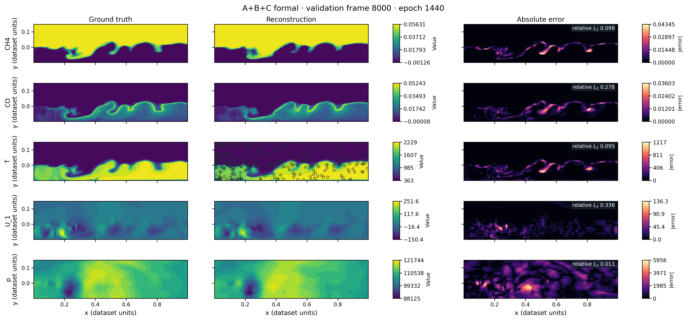
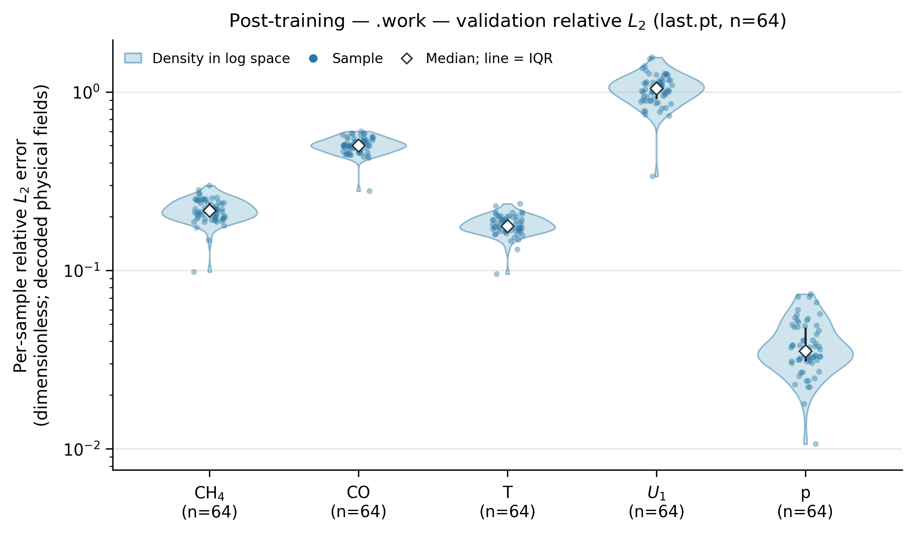
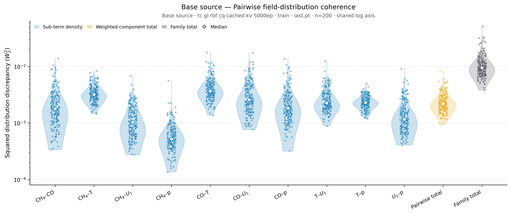
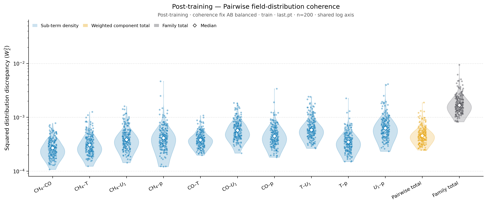
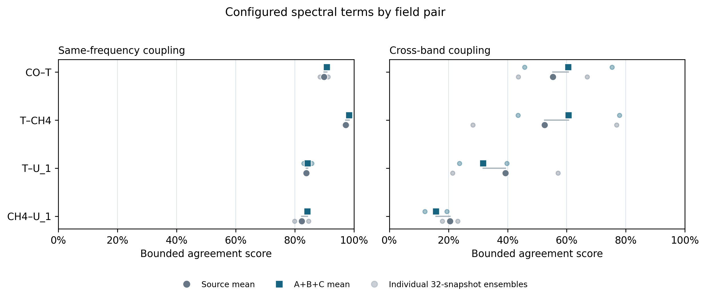

# PhyCoFlow Multi-Field Reconstruction

PhyCoFlow reconstructs complete physical states from sparse, multi-field measurements. The primary research workflow studies whether data-driven physical-coherence post-training improves the coherence of a reconstructed state while preserving the immutable source checkpoint and the supervised data contract.

> **Current topology method:** efficient sliced-persistence post-training is the active workflow in this main repository. Start with [TOPOLOGY_POSTTRAINING.md](TOPOLOGY_POSTTRAINING.md) for its objective, canonical recipe, launch command and verification.

The cross-spectrum `self_spectrum` term remains opt-in because its raw-power calculation can be unstable. Topology includes several research strategies; the active-emulsion recipe uses native periodic `cubical_persistence`. Its execution and training updates have been verified; scientific efficacy depends on the selected checkpoint and held-out evaluation.

The standard lifecycle is:

```text
dataset contract → case + sensors → shared model → base checkpoint
                                               ↓
                              coherence post-training → evaluation
```

Physics-informed training and historical compatibility routes are available, but remain explicit alternatives to this primary workflow.

## 0. Table of contents

- [1. Start here](#1-start-here)
  - [1.1 First successful local run](#11-first-successful-local-run)
  - [1.2 Which command should I use?](#12-which-command-should-i-use)
- [2. Repository architecture](#2-repository-architecture)
- [3. Dataset contract](#3-dataset-contract)
- [4. Use an existing case or build a new one](#4-use-an-existing-case-or-build-a-new-one)
  - [4.1 Use an existing case](#41-use-an-existing-case)
  - [4.2 Build a new case](#42-build-a-new-case)
- [5. Prepare a config, select a model, and pre-train](#5-prepare-a-config-select-a-model-and-pre-train)
  - [5.1 Understand config composition](#51-understand-config-composition)
  - [5.2 Select a model](#52-select-a-model)
  - [5.3 Validate, smoke-test, train, and resume](#53-validate-smoke-test-train-and-resume)
  - [5.4 Model-specific examples](#54-model-specific-examples)
- [6. Coherence post-training](#6-coherence-post-training)
  - [6.1 Prepare a portable configuration](#61-prepare-a-portable-configuration)
  - [6.2 Validate and launch](#62-validate-and-launch)
- [7. Evaluation and local outputs](#7-evaluation-and-local-outputs)
  - [7.1 Single-snapshot reconstruction figure](#71-single-snapshot-reconstruction-figure)
  - [7.2 Multi-snapshot reconstruction statistics](#72-multi-snapshot-reconstruction-statistics)
  - [7.3 Multi-snapshot physical-coherence statistics](#73-multi-snapshot-physical-coherence-statistics)
    - [7.3.1 Global-distribution coherence](#731-global-distribution-coherence)
    - [7.3.2 Cross-spectrum coherence](#732-cross-spectrum-coherence)
    - [7.3.3 Topology coherence](#733-topology-coherence)
- [8. Benchmarks and reproducibility](#8-benchmarks-and-reproducibility)
- [9. Contributing](#9-contributing)
  - [9.1 Find the right code boundary](#91-find-the-right-code-boundary)
  - [9.2 Make and verify a change](#92-make-and-verify-a-change)

## 1. Start here

Run every command in this README from the repository root unless a section says otherwise. Install the shared package in a virtual environment or conda environment:

```bash
conda env create -f environment.yml
conda activate phycoflow_reconstruction
python -m pip install -e '.[dev]'
```

The optional `operator` extra provides `neuraloperator` for GeoFNO and the FNO PointCloudFFM backbone. The `posttrain` extra provides ConFIG gradient balancing, and `legacy` provides the optional Demo50 neighbor-search path. Install only the extras needed by the selected config, for example `python -m pip install -e '.[dev,operator,posttrain]'`.

### 1.1 First successful local run

Datasets are intentionally local and are normally not committed. Link a payload into the canonical catalog without copying it, then validate it:

```bash
python scripts/data/link_dataset.py \
  --case brusselator \
  --source /absolute/path/to/brusselator.h5

python scripts/data/validate_dataset.py datasets/brusselator/brusselator.h5
python cases/brusselator/run.py validate \
  --config configs/base/coordinate_mlp.yaml
```

Launch a one-step CPU smoke run before spending time on a full experiment:

```bash
python cases/brusselator/run.py train-base \
  --config configs/base/coordinate_mlp.yaml \
  --override runtime.device=cpu \
  --max-steps 1
```

Remove `--max-steps 1` for a real run. Outputs are written under `cases/brusselator/runs/<experiment_name>/<run-id>/`; this directory is intentionally ignored by Git.

### 1.2 Which command should I use?

Every case exposes the same thin command-line interface through `cases/<case>/run.py`:

| Goal | Command | Main input |
|---|---|---|
| Check a composed config and local dataset | `validate` | `--config <yaml>` |
| Freeze sensor locations for matched comparisons | `build-manifest` | config, split, output path |
| Pre-train/base-train a reconstruction model | `train-base` | base config |
| Refine an immutable trained model | `post-train` | post-training config plus `source_run` |
| Train a direct physics-informed model | `train-direct` | direct-physics config |
| Produce numerical metrics for a run | `evaluate-run` | run directory and checkpoint |
| Rebuild training/coherence history figures | `render-history` | run directory |
| Produce snapshot, set, and coherence figures | `visualize-run` | run directory and visualization options |

Use `python cases/<case>/run.py <command> --help` for the exact options supported by the checked-out code. A practical end-to-end path is:

```text
link + validate dataset
        ↓
validate base config → train-base → evaluate-run / visualize-run
                                      ↓
                 validate post config → post-train → compare / visualize
```

## 2. Repository architecture

The reusable implementation is under `src/phycoflow_reconstruction/`:

- `contracts.py` defines dataset, observation, reconstruction, loss, capability, coherence, and physics boundaries;
- `data/` handles payload adapters, normalization, splits, manifests, and sensor protocols;
- `models/` contains deterministic, generative, operator, flow, and isolated historical-compatibility adapters;
- `coherence/` contains reference banks, family composition, observation consistency, and the global-distribution, cross-spectrum, and topology families;
- `training/` owns base training, coherence/physics post-training, direct physics, checkpoints, rollout, previews, and monitoring;
- `evaluation/`, `physics/`, `config/`, and `cli.py` provide shared evaluation, case-independent physics interfaces, config composition, and command routing.

The point-cloud flow package keeps the low-level tensor core separate from the project adapter:

```text
models/flows/pointcloud/core/       model math, geometry, attention, priors,
                                   tensor training/reconstruction primitives
models/flows/pointcloud/runtime/   builder, EMA, checkpoint and tensor runtime
models/flows/pointcloud/adapters/  project contracts, lifecycle, registry glue
```

See [docs/architecture.md](docs/architecture.md) for dependency direction and [docs/models.md](docs/models.md) for model capabilities and stages.

Each `cases/<case>/` directory owns only scientific meaning and launch profiles: field metadata, physical diagnostics/providers, dataset selection, sensor protocols, coherence/physics settings, and a thin `run.py`. Generic models and trainers never import a named case.

Generic model fragments live once in `configs/models/`; shared runtime, optimization, evaluation, and checkpoint defaults live in `configs/defaults/`. Case launch profiles compose those fragments and carry only scientifically meaningful overrides. Configuration ownership and composition rules are described in [docs/configuration.md](docs/configuration.md).

## 3. Dataset contract

`datasets/` is a local catalog, not a place to commit normal payloads. Track the schema and reproducibility instructions, while keeping HDF5/PT/NumPy payloads, links, and derived caches local. The canonical contract requires a dense field state, coordinates, time/condition metadata, field order, logical shape, and declared train/validation/test split semantics. See:

- [datasets/README.md](datasets/README.md) for the catalog;
- [datasets/SCHEMA.md](datasets/SCHEMA.md) for the accepted HDF5/PT structure;
- [docs/reproducibility.md](docs/reproducibility.md) for normalization, lineage, and release rules.

Validate an individual payload or all known catalog entries:

```bash
python scripts/data/validate_dataset.py datasets/brusselator/brusselator.h5
python scripts/data/validate_dataset.py --all
```

Missing optional local payloads are reported by validation; they are never fabricated by the repository.

## 4. Use an existing case or build a new one

### 4.1 Use an existing case

The maintained case workspaces are under `cases/`. Start by reading `cases/<case>/README.md`, then inspect its `configs/dataset.yaml`, sensor profiles, and base launch profiles. From the repository root:

```bash
python cases/brusselator/run.py validate \
  --config configs/base/coordinate_mlp.yaml
```

Paths passed to a case launcher are resolved relative to that case directory. Therefore `--config configs/base/coordinate_mlp.yaml` means `cases/brusselator/configs/base/coordinate_mlp.yaml`, while commands in `scripts/` normally receive repository-relative paths.

Sensor definitions live under `cases/<case>/configs/sensors/`. Random sensor profiles are appropriate for training; use a fixed manifest when runs must see exactly the same locations:

```bash
python cases/brusselator/run.py build-manifest \
  --config configs/base/coordinate_mlp.yaml \
  --split validation \
  --max-samples 8 \
  --output manifests/validation_sensors.json
```

Manifests are local/generated and should not be committed except for a small, immutable benchmark fixture explicitly covered by a test and reproduction protocol.

### 4.2 Build a new case

Use `cases/brusselator/` as the clearest complete example. A new `cases/<new_case>/` should contain scientific meaning and launch profiles, not copies of shared trainers or models:

1. Add `case.py` and register one `CaseSpec` with the case name, ordered field names and units, reconstruction unit, mesh type, logical grid shape, and optional physics/diagnostics factories.
2. Add a thin `run.py` that places the repository `src/` directory on `sys.path`, imports the case registration, and calls `run_case_cli("<new_case>", Path(__file__).resolve().parent)`.
3. Document the local payload under `datasets/<new_case>/README.md`, add it to the table in `datasets/README.md`, and create `cases/<new_case>/configs/dataset.yaml` with paths, field order, split policy, and normalization source.
4. Add sensor profiles under `configs/sensors/`. Make field names and counts match the dataset contract exactly.
5. Add discoverable base launch profiles under `configs/base/`. Each profile should compose shared defaults, the case dataset, one sensor profile, and one shared model fragment.
6. Add `diagnostics.py` only for case-specific physical metrics. Add `physics.py` only when the case exposes a differentiable `PhysicsProvider` for direct or physics post-training.
7. Add a short case README explaining the physics, fields, expected payload, supported models, sensors, and known limitations.
8. Validate the dataset and every new config, run a one-step CPU smoke, and add contract tests for registration, shapes, field order, splitting, and any physics/diagnostic boundary.

Generic implementation always belongs under `src/phycoflow_reconstruction/`. If code would be useful to two cases, move it into the shared package instead of copying it between case directories.

## 5. Prepare a config, select a model, and pre-train

### 5.1 Understand config composition

Config files use an ordered `defaults` list. Files are merged from top to bottom, and the leaf file wins. A normal base profile has four layers:

```yaml
# cases/<case>/configs/base/<model>.yaml
defaults:
  - ../../../../configs/defaults/base_training.yaml
  - ../dataset.yaml
  - ../sensors/<sensor_profile>.yaml
  - ../../../../configs/models/<model>.yaml

case: <case>
optimization: {batch_size: 4, epochs: 1000}
runtime: {device: cuda:0, seed: 42}
output: {experiment_name: <case>_<model>_base}
```

Keep each setting with its owner:

| Setting | Put it here |
|---|---|
| Generic architecture and model name | `configs/models/` |
| Shared training, runtime, evaluation, checkpoint defaults | `configs/defaults/` |
| Payload, fields, splits, normalization | `cases/<case>/configs/dataset.yaml` |
| Sensor fields, counts, protocol, seed | `cases/<case>/configs/sensors/` |
| Small case/model launch overrides | `cases/<case>/configs/base/` |
| Temporary local experiments | `cases/<case>/configs/_experiments/` (untracked) |
| Coherence or physics hypothesis | case `coherence/`, `posttrain/`, or `direct_physics/` |

Use repeated dotted CLI overrides for machine- or run-specific values instead of editing a tracked scientific config:

```bash
python cases/<case>/run.py validate \
  --config configs/base/<model>.yaml \
  --override runtime.device=cuda:1 \
  --override optimization.batch_size=2
```

Do not put an absolute workstation path, a one-off GPU choice, or a coworker's run ID into a reusable tracked profile. See [docs/configuration.md](docs/configuration.md) for composition and compatibility rules.

### 5.2 Select a model

The public registry names and their intended entry points are:

| Model | Use it when | Important note |
|---|---|---|
| `coordinate_mlp`, `mlp_rbf` | A small deterministic point baseline is sufficient | Fastest place to test a new case contract |
| `deeponet`, `senseiver` | Sparse sensor-token reconstruction is needed | Deterministic masked-MSE training |
| `geofno` | A structured-grid operator is appropriate | Install the `operator` extra |
| `diffusion_pde` | A grid-based generative reconstruction is needed | Complete 2-D targets; U-Net can require substantial GPU memory |
| `latent_fm` | Latent generative flow is desired | Train Stage 1 first; Stage 2 is the reconstruction source |
| `pointcloud_ffm` | Point-cloud rectified flow is desired | FNO backbone may need the `operator` extra |
| `gl_rbf_cq` | Coherence-ready point-cloud flow with cached K/V is needed | Preserve checkpoint/state compatibility contracts |
| `pinn` | Direct equation-based training is required | Use `train-direct`, not `train-base` |

Read [docs/models.md](docs/models.md) before changing a model or selecting one for a formal experiment. Point models consume sparse observation tokens; grid/operator models rasterize observations and their support mask. Diffusion and flow models retain their native noise/velocity objectives.

### 5.3 Validate, smoke-test, train, and resume

Always validate the fully composed config first:

```bash
python cases/<case>/run.py validate --config configs/base/<model>.yaml
```

Then run a short smoke and the real pre-training/base-training job:

```bash
# Integration smoke only; its checkpoint is not a scientific source run.
python cases/<case>/run.py train-base \
  --config configs/base/<model>.yaml \
  --override runtime.device=cpu \
  --max-steps 1

# Full run.
python cases/<case>/run.py train-base \
  --config configs/base/<model>.yaml
```

To continue an interrupted compatible run, pass its rolling checkpoint explicitly:

```bash
python cases/<case>/run.py train-base \
  --config configs/base/<model>.yaml \
  --resume runs/<experiment>/<run-id>/checkpoints/last.pt
```

Each run stores the resolved config, checkpoints, metrics, provenance, histories, and previews under `cases/<case>/runs/<experiment>/<run-id>/`. Inspect `resolved_config.yaml` before comparing runs: it is the authoritative record of what was actually launched.

### 5.4 Model-specific examples

The tracked Senseiver example below shows the total training objective and fixed-validation loss over a completed 5,000-epoch turbulent-combustion base run. Each run writes its current `loss_history.png` at the run root.


DiffusionPDE supports two interchangeable denoising backbones. The maintained `configs/models/diffusion_pde.yaml` profile selects a time-conditioned, multiscale U-Net with configurable channel multipliers, residual depth, timestep embedding, coarse-level attention, attention heads, and dropout. The original three-convolution implementation remains available as the lightweight, checkpoint-compatible `plain_cnn` option:

```bash
# Maintained conditional U-Net profile.
python cases/<case>/run.py train-base --config configs/base/diffusion_pde.yaml

# Select the legacy plain CNN without editing the shared model fragment.
python cases/<case>/run.py train-base --config configs/base/diffusion_pde.yaml \
  --override model.backbone=plain_cnn
```

Both backbones use the same cosine noise schedule, noise-prediction loss, and deterministic DDIM-style reconstruction with observed values clamped after each sampling update. They require complete two-dimensional target grids. The U-Net uses considerably more accelerator memory, especially when attention is enabled; set the case-level training batch size accordingly.

Latent flow has an explicit two-stage lifecycle:

```bash
python cases/<case>/run.py train-base --config configs/base/latent_fm_stage1.yaml
python cases/<case>/run.py train-base --config configs/base/latent_fm_stage2.yaml \
  --override model.stage1_checkpoint=runs/<stage1>/<run-id>/checkpoints/best.pt
```

Stage 2 strictly loads and freezes the Stage-1 autoencoder. It is the sparse reconstruction source; Stage 1 is a prerequisite checkpoint only.

## 6. Coherence post-training

Post-training creates a child run from a completed, immutable base run. The selected source checkpoint is loaded strictly, while the dataset, model, observations, normalization, and provenance are inherited from the source run's `resolved_config.yaml`; the source run is hashed before and after training and is never modified.

The available coherence families are `global_distribution`, `cross_spectrum`, and `topology`. The current topology family uses `cubical_persistence` with `sliced_wasserstein` diagram matching. [TOPOLOGY_POSTTRAINING.md](TOPOLOGY_POSTTRAINING.md) describes the single-family `topology_regularized` recipe on native grids; the turbulent-combustion A+B+C experiment instead composes the three families with `gradient_balance: config` and scores topology on its configured fixed-query raster. Both compare H0/H1 persistence with one differentiable update per batch. The [topology family guide](src/phycoflow_reconstruction/coherence/families/topology/README.md) defines the mathematics. Earlier Betti-curve and spatial implementations remain for explicit historical configurations. Cross-spectrum `self_spectrum` retains its existing development status.

### 6.1 Prepare a portable configuration

Keep reusable family definitions under `cases/<case>/configs/coherence/`, normal launch profiles under `cases/<case>/configs/posttrain/`, and matched readiness or ablation matrices under `cases/<case>/configs/readiness/`. A standard launch profile uses a common execution file plus a small scientific leaf file. Do not commit machine-specific absolute source paths: set `source_run: null` in the common file and supply the run at launch time.

The common file owns the source contract, optimizer, runtime, rollout, evaluation, and shared coherence compute budget. This compact template is suitable for a native completed run and can be adapted to another case by changing `<case>` and the numerical budgets:

```yaml
# cases/<case>/configs/posttrain/_common.yaml
stage: post_training
case: <case>
source_run: null
source_checkpoint: best.pt
inherit_base_config: true
source: {kind: native_run, allow_integration_source: false}

objectives:
  data_retention: {enabled: true, weight: 0.1}
  coherence: {enabled: true, weight: 1.0}

rollout: {steps: 2, solver: euler}
observation_consistency: {mode: endpoint_smooth, strength: 1.0, sigma: 0.05, schedule_power: 2.0, final_clamp: true, chunk_size: 4096}
trainable: {scope: full_model}

optimization: {epochs: 1000, batch_size: 16, train_fraction: 0.2, lr: 5.0e-5, weight_decay: 1.0e-6, grad_clip: 1.0, gradient_balance: weighted_sum, config_missing_behavior: error}
runtime: {seed: 42, device: cuda:0, deterministic: true, num_workers: 0, data_strategy: async_cpu, progress: true}
evaluation: {split: validation, max_samples: 32, query_points: 4096, generation_steps: 2, seed: 2027}
checkpointing: {enabled: true, every_epochs: 10, save_epoch_one: true, selection_metric: reconstruction_mse}
posttrain_fidelity: {max_relative_mse_increase: 0.05, behavior: report}

coherence:
  schedule: {start_epoch: 1, every_n_steps: 1, weight_warmup_epochs: 0, interval_rescale: false}
  compute_budget: {batch_size: 16, point_count: 4096, query_policy: fixed_shared, query_seed: 100045}
```

The leaf file owns the scientific hypothesis: enabled families, field names from the inherited dataset contract, component weights, target source, family balancing, and the experiment name. For example:

```yaml
# cases/<case>/configs/posttrain/global_distribution_paired.yaml
defaults: [_common.yaml]

coherence:
  family_balance: {mode: none}
  families:
    global_distribution:
      enabled: true
      weight: 1.0
      target_use: paired_supervised
      units: model_units
      fields: [<field_a>, <field_b>]
      reference_bank: {enabled: false}
      components:
        self: {enabled: true, weight: 1.0}
        mutual: {enabled: true, weight: 1.0, directions: 8, seed: 1234}
        cross: {enabled: true, weight: 1.0, directions: 16, top_fraction: 0.1, seed: 1234, include_axes: true, qmc: true}

output: {experiment_name: <case>_posttrain_global_distribution}
```

A cross-spectrum family should normally keep the pending per-field auto-spectrum term disabled while using the distinct-field terms:

```yaml
coherence:
  families:
    cross_spectrum:
      enabled: true
      weight: 1.0
      target_use: paired_supervised
      units: model_units
      fields: [<field_a>, <field_b>, <field_c>]
      pairs: [[<field_a>, <field_b>], [<field_b>, <field_c>]]
      components:
        self_spectrum: {enabled: false, weight: 1.0}  # pending further development
        same_frequency: {enabled: true, weight: 1.0}
        cross_frequency: {enabled: true, weight: 1.0}
        band_energy: {enabled: false, weight: 0.0}
```

`self_spectrum` is an explicit mode-by-mode auto-spectrum loss for every selected field; it does not need a field pair and needs only one ensemble state. Its current raw-power calculation can be unstable, so it is opt-in and runs only when `self_spectrum.enabled: true` is explicit; omission defaults to disabled. Coworkers developing this term should isolate it in a clearly labeled experimental config and add numerical stability tests. `same_frequency` compares normalized cross-field coherence for each configured distinct-field pair at the same graph mode, while `cross_frequency` compares coupling for distinct fields across different graph-frequency bands (and therefore needs a coherence batch of at least 3). The optional coarse `band_energy` term compares log spectral power aggregated over each band. These component choices are orthogonal to `target_use`: `paired_supervised` supplies the dense target from the current sample after reconstruction, whereas `training_reference` uses an independently sampled frozen training reference bank.

Every data-driven coherence post-training run writes two restart-safe figures at its run root. `loss_history.png` retains the compact native-data/coherence/validation overview. `coherence_history.png` groups enabled components by family and gives every subterm an independently scaled history panel, so marginal, pairwise, joint, spectral, and topology losses remain readable even when their raw magnitudes differ by orders of magnitude. The top panel shows total coherence and, for multi-family runs, calibrated weighted family contributions. Component panels show raw scientific losses and disclose their effective inner-weight × outer-weight × calibration multiplier. Disabled components are omitted, sparse schedules begin only where coherence was evaluated, and partial epochs use open markers.

Both new namespaced component histories and older flat component keys are supported. Re-render an existing or active run without loading its model or dataset:

```bash
python cases/<case>/run.py render-history \
  --run runs/<experiment>/<run-id>
```

Use `target_use: paired_supervised` with `reference_bank.enabled: false` when every reconstruction is compared with its own dense target. Use `target_use: training_reference` with an enabled reference bank when matching an independently sampled training distribution; its `points_per_sample` must equal `coherence.compute_budget.point_count`. Cross-spectrum requires `query_policy: fixed_shared`; same-frequency requires coherence batch size at least 2, cross-frequency requires at least 3, and `optimization.batch_size` must not be smaller than the coherence batch size. Topology also requires fixed shared queries. For a single supported family, `family_balance.mode: none` is the clear default; for multiple families with different raw scales, use `initial_grad_norm` and record its calibration settings.

### 6.2 Validate and launch

Run both commands from the repository root. The launcher resolves the config and source run relative to `cases/<case>/`, inherits the source contracts, validates the post-training schema, and checks the dataset before any optimization begins:

```bash
python cases/<case>/run.py validate \
  --config configs/posttrain/<profile>.yaml \
  --override source_run=runs/<base-experiment>/<run-id> \
  --override source_checkpoint=best.pt

python cases/<case>/run.py post-train \
  --config configs/posttrain/<profile>.yaml \
  --override source_run=runs/<base-experiment>/<run-id> \
  --override source_checkpoint=best.pt
```

Choose the checkpoint explicitly: `best.pt` starts from the best fixed-validation reconstruction, while `last.pt` starts from the final training state. Add `--override runtime.device=<device>` when the config's default device is unsuitable. A successful launch creates `cases/<case>/runs/<experiment_name>/<run-id>/` containing the resolved config, parent/checkpoint lineage and hashes, checkpoints, metrics, previews, and fidelity report. Use `--max-steps 1` only for an intentional smoke run; set `source.allow_integration_source=true` only when the source itself is explicitly an incomplete integration fixture.

The implemented family names are `global_distribution`, `cross_spectrum`, and `topology`, and one leaf config can compose several families over the same differentiable reconstruction. Efficient topology post-training uses the common lifecycle with `optimization.gradient_balance: topology_regularized`; its native-grid, source-fidelity and held-out selection requirements are documented in the topology guide. The cleaned GL-RBF/CQ path preserves state-dict keys, seeded behavior, cached-K/V execution, query microbatching, geometry/reconstruction caches, EMA state, and observation consistency.

For a physics post-training route, use a case that exposes a differentiable `PhysicsProvider` (currently Brusselator):

```bash
python cases/brusselator/run.py post-train \
  --config configs/posttrain/physics_periodic.yaml \
  --override source_run=runs/<base-experiment>/<run-id>
```

Direct PINN training is a separate route:

```bash
python cases/brusselator/run.py train-direct --config configs/direct_physics/pinn.yaml
```

## 7. Evaluation and local outputs

The [turbulent-combustion figure gallery](cases/turbulent_combustion/diagnostics/README.md)
separates operational training monitors, field reconstruction, quantitative
coherence evaluation, and explanatory coherence views. It records the
comparison scales and provenance needed to interpret the examples below.

Post-processing never retrains the model. Point it at an existing base or post-training run and choose the tool by output:

| Need | Use | Typical output |
|---|---|---|
| Machine-readable reconstruction errors | `evaluate-run` | JSON report with normalized/physical and observed/unobserved metrics |
| One qualitative full-field reconstruction | `visualize-run` | 300-DPI reconstruction PNG plus portable NPZ payload |
| Error distributions over many snapshots | `visualize-run --eval-set ...` | violin/scatter figure, CSV, NPZ, and JSON |
| Supported physical-coherence comparisons | add `--eval-coherence ...` | family-specific figures and numerical artifacts |
| Re-render saved coherence components | `render-history` | `coherence_history.png` |
| Review training objectives, gradients, and checkpoint gates | [A+B+C diagnostic gallery](cases/turbulent_combustion/diagnostics/ExampleVisual/README.md) | four history figures plus frozen numerical evidence |
| Re-render a saved preview without a model | visualization script with `--payload` | PNG from a portable NPZ |

Start with `best` for the checkpoint selected by fixed validation, or choose `last` when the final optimization state is scientifically relevant. Use `--weight-selection configured` unless intentionally diagnosing live rather than configured/EMA weights. Keep the same split, sensor manifest, sample IDs, generation steps, and seeds for a fair comparison.

Evaluate any base or child run with a sensor config or fixed manifest:

```bash
python cases/<case>/run.py evaluate-run \
  --run runs/<experiment>/<run-id> \
  --checkpoint best \
  --sensor-config configs/sensors/u_only_random.yaml \
  --split validation --max-samples 8 \
  --report-name validation
```

The evaluator records normalized/physical errors, observed/unobserved metrics, sample/query/sensor identities, diagnostics, timing, and provenance. Generated checkpoints, manifests, reports, previews, figures, caches, and histories stay under `cases/<case>/runs/` and are ignored by Git.

Rebuild the saved coherence component history at any time without loading the model or dataset:

```bash
python cases/<case>/run.py render-history \
  --run runs/<experiment>/<run-id>
```

The [turbulent-combustion history renderer](cases/turbulent_combustion/diagnostics/ExampleVisual/README.md) also produces separate objective, gradient, and checkpoint-fidelity figures from a chosen cutoff of a run's saved metrics. It reads the active run without changing its training process.

### 7.1 Single-snapshot reconstruction figure

From the repository root, the simple form is:

```bash
python cases/<case>/run.py visualize-run --run runs/<experiment>/<run-id>
```

With no optional arguments, this loads `best.pt`, selects snapshot `0` relative to the test split, and uses the sparse observation protocol and generation settings in `resolved_config.yaml`. It always reconstructs the complete grid and writes a 300-DPI PNG.

A historical fully explicit Senseiver command is:

```bash
python cases/turbulent_combustion/run.py visualize-run \
  --run runs/tc_senseiver_5000ep/20260828T190145Z_fea0fc25 \
  --checkpoint best \
  --split test \
  --snapshot-index 0 \
  --generation-steps 4 \
  --device cuda:2 \
  --contour-levels 20 \
  --weight-selection configured
```

- `--snapshot-index` is relative to the selected split.
- Omit `--sensor-config` and `--sensor-manifest` to use the observation protocol recorded by the run. Supplying either option overrides or replays that protocol.
- `--contour-levels` controls the filled field and absolute-error contours. Target and reconstruction share one color scale per field, while absolute error starts at zero on its own scale.
- Figure size, spacing, and text scale adapt to the physical-domain aspect ratio and field count.
- A CUDA-memory warning appears before inference when the selected device may be tight; choose a different device with `--device`.

Outputs are stored under `evaluation/reconstruction_<split>_<snapshot>_<checkpoint>/`: `reconstruction.png`, `report.json`, `sensor_manifest.json`, `query_indices.pt`, and the portable plotting payload `reconstruction.npz`. The former duplicate `reconstruction.pt` is no longer written.



The [pinned plotting payload and provenance](cases/turbulent_combustion/diagnostics/ExampleVisual/README.md) make this epoch-1440 A+B+C example reproducible without model inference. The Senseiver command above remains a historical command example.

### 7.2 Multi-snapshot reconstruction statistics

Add `--eval-set` to render each field's physical-space relative $L_2$ distribution as a violin plot overlaid with individual sample points. The quick form is:

```bash
python cases/<case>/run.py visualize-run \
  --run runs/<experiment>/<run-id> --eval-set test
```

A historical fully explicit Senseiver set-evaluation command is:

```bash
python cases/turbulent_combustion/run.py visualize-run \
  --run runs/tc_senseiver_5000ep/20260828T190145Z_fea0fc25 \
  --checkpoint best \
  --eval-set test \
  --eval-samples 200 \
  --generation-steps 4 \
  --device cuda:2 \
  --weight-selection configured
```

`--eval-set` accepts `train`, `validation`, or `test`. The default limit is 200 deterministic, evenly spaced samples across that split; request more with `--eval-samples 500` or the complete split with `--eval-samples all`. Statistical distribution plots use a logarithmic vertical scale by default; select the normal linear scale with `--stat-scale linear`. For snapshot datasets each sample is one snapshot; trajectory datasets are evaluated one trajectory at a time. The model and checkpoint load once while full-grid samples stream individually to bound memory.

Outputs are written under `evaluation/reconstruction_set_<split>_<checkpoint>/` and include the 300-DPI violin/scatter figure, summary report, per-sample CSV, reusable NPZ metrics, and streaming sensor manifest.

When the target is a post-training run, statistical evaluation also evaluates the exact source checkpoint recorded by the run lineage. The base and post-training models use identical split-relative samples, sensor selections, generation settings, seeds, and coherence definitions. Current-run figures keep their standard names, while each base-run figure is written beside its counterpart with a `-base` suffix, for example `relative_l2_violin.png` and `relative_l2_violin-base.png`; corresponding reconstruction and distribution figures share the same vertical limits, while cross-spectrum figures retain the common bounded 0–1 score axis. `comparison_report.json` records both checkpoints, matched-input hashes, shared limits, and artifact paths. Add `--no-base-comparison` only when the extra source-checkpoint evaluation is intentionally unnecessary.



The [current diagnostic suite](cases/turbulent_combustion/diagnostics/ExampleVisual/README.md) includes matched 64-snapshot source/A+B+C metrics, a physical-coordinate full-grid reconstruction, and a fixed 4,096-point illustrative view from the same full-grid inference.

### 7.3 Multi-snapshot physical-coherence statistics

Add `--eval-coherence` to the same set evaluation to calculate paired reconstruction-to-ground-truth coherence metrics alongside the default relative-$L_2$ results. For the A+B+C run, request all three configured families:

```bash
python cases/<case>/run.py visualize-run \
  --run runs/<experiment>/<run-id> \
  --eval-set test \
  --eval-coherence global_distribution cross_spectrum topology
```

Use one or several family names when only part of that evaluation is needed. `--eval-coherence` requires `--eval-set`, accepts `global_distribution`, `cross_spectrum`, and `topology`, and writes each family into `evaluation/reconstruction_set_<split>_<checkpoint>/coherence/<family>/` so figures and numerical artifacts remain separated. The topology set view requires a configured cubical-persistence family and the training `fixed_shared` query policy.

For a post-training target, the same command automatically adds a matched `-base` figure beside each standard post-training coherence figure. The base calculation uses the child run's coherence evaluation contract and the same selected samples, sensor observations, inference settings, and plot limits, so corresponding figures are directly comparable. A requested family configured in the post-training run evaluates the coherence quantity used during training; a requested but unconfigured family uses the repository's paired-ground-truth default and should be interpreted as an auxiliary diagnostic. Use `--no-base-comparison` to skip source-checkpoint evaluation.

#### 7.3.1 Global-distribution coherence

The fully explicit global-distribution command for the AB post-training example is:

```bash
python cases/turbulent_combustion/run.py visualize-run \
  --run runs/coherence_fix_AB_balanced/20260829T235221Z_b3b586c4 \
  --checkpoint last \
  --eval-set train \
  --eval-samples 200 \
  --eval-coherence global_distribution \
  --stat-scale log \
  --generation-steps 2 \
  --device cuda:0 \
  --weight-selection configured
```

Global-distribution evaluation is calculated per snapshot and produces separate violin/scatter figures for marginal field distributions, pairwise field distributions, and joint top-tail distributions. Each figure includes its sub-terms, weighted component total, and family total. Use `--stat-scale linear` when a normal vertical scale is preferred; the default is logarithmic. The family directory also contains `metrics.csv`, `metrics.npz`, and `report.json`.

Add `--extraview-coherence` to render a dedicated ground-truth-versus-reconstruction joint-PDF figure for every field pair represented in `pairwise_field_distributions.png`:

```bash
python cases/<case>/run.py visualize-run \
  --run runs/<experiment>/<run-id> \
  --checkpoint last \
  --eval-set test \
  --eval-coherence global_distribution \
  --extraview-coherence
```

The extra views are written under `coherence/global_distribution/global_distribution_extra/`. Each 300-DPI figure compares ground-truth and reconstruction joint densities on shared axes, bins, and density normalization and marks the Jensen–Shannon divergence in bits, where `0` is identical and `1` is maximally separated. The default evaluation pools deterministic spatial samples from all 200 selected snapshots; larger or full-set evaluations automatically reduce points per snapshot to keep memory bounded without dropping snapshots. For post-training runs, standard filenames represent the assigned checkpoint and adjacent `-base` files represent its source checkpoint, with the same samples and visualization scales. CSV, NPZ, and JSON artifacts retain the probability masses, bin edges, sampling contract, and divergence values.

> **Extra-view support:** `--extraview-coherence` adds the optional global-distribution joint-PDF gallery. Cross-spectrum band profiles and topology interpretation panels are produced directly by `--eval-coherence` for their respective families.

The CO–T example below compares the source `last.pt` checkpoint with the AB post-training `last.pt` checkpoint over the same 200 test snapshots.

<p align="center"> </p>

<p align="center"><em>Left: base source. Right: post-training checkpoint. Both figures share samples, bin edges, field axes, and density normalization.</em></p>

The paired statistical example below compares the source `last.pt` checkpoint with the AB post-training `last.pt` checkpoint over the same 200 training snapshots. Both pairwise field-distribution figures use identical samples and logarithmic vertical limits; the standard filename identifies the post-training result and the adjacent `-base` filename identifies its source counterpart.

<p align="center"> </p>

<p align="center"><em>Left: base source. Right: post-training checkpoint. Shared samples and vertical scale make the distributions directly comparable.</em></p>

#### 7.3.2 Cross-spectrum coherence

The fully explicit cross-spectrum command for the same checkpoint is:

```bash
python cases/turbulent_combustion/run.py visualize-run \
  --run runs/coherence_fix_AB_balanced/20260829T235221Z_b3b586c4 \
  --checkpoint last \
  --eval-set train \
  --eval-samples 200 \
  --eval-coherence cross_spectrum \
  --cross-spectrum-aggregation training_aligned \
  --generation-steps 2 \
  --device cuda:0 \
  --weight-selection configured
```

Cross-spectrum evaluation defaults to `--cross-spectrum-aggregation training_aligned`: it reads `coherence.compute_budget.batch_size` from the resolved configuration, divides the selected set into deterministic complete ensembles of that size, applies the same spectral calculations used during post-training to every ensemble, and reports their mean with ±1 standard-deviation whiskers. Incomplete trailing samples are excluded and recorded explicitly; for example, 200 selected snapshots with a coherence batch size of 16 produce 12 ensembles, 192 used samples, and 8 recorded as dropped. Use `--cross-spectrum-aggregation pooled` only when one all-snapshot diagnostic ensemble is intentionally required.

The horizontal-bar figures report the enabled self-spectrum, same-frequency, and cross-frequency agreement scores on a fixed linear range from 0 to 1, where 1 means exact spectral agreement; `--stat-scale` therefore does not alter these charts. When enabled, self-spectrum bars are one per selected field, whereas the two distinct-field terms report one per configured pair. The additional `spectral_band_profiles.png` shows reference and reconstruction energy fractions by graph-frequency band, which gives the bounded scores a more direct interpretation. Per-ensemble values, averaged raw mean-squared discrepancies, normalized scores, spread statistics, ensemble membership, and dropped sample IDs are retained in `metrics.csv`, `metrics.npz`, and `report.json`. If spectral-band energy is enabled in the run's coherence configuration, its score figure is generated in the same family directory.

The current paired example compares the source checkpoint with the A+B+C formal epoch-1440 checkpoint over two matched 32-snapshot validation ensembles. It shows every configured field pair and both enabled spectral terms on the same bounded score axis.



The [full coherence gallery and pinned metrics](cases/turbulent_combustion/diagnostics/ExampleVisual/README.md) also show reference/source/A+B+C band-energy profiles and their percentage-point differences.

#### 7.3.3 Topology coherence

For a run configured with the cubical-persistence family, request `--eval-coherence topology` with `--eval-set`. The evaluator replays the run's deterministic `fixed_shared` point selection and configured topology raster, then compares each reconstructed snapshot with its paired dense target. It writes three complementary figures under `coherence/topology/`: `persistence_term_distributions.png` shows the configured sliced-Wasserstein H0/H1 objective components and their component-weighted total; `betti_curves.png` shows exact H0/H1 counts at reference-defined filtration quantiles; and `configured_grid_topology.png` shows paired median-level geometry and disagreement on the configured raster. The median-level image is an interpretation aid, not a persistence diagram or a native-grid topology claim. Each figure has PNG, PDF, and SVG forms, with CSV/NPZ/JSON numerical provenance.

The component-weighted topology total is shown before the outer family weight. Its magnitude cannot establish the term's share of the parameter update; use the run's gradient diagnostics for update balance. The set plots evaluate paired references on the recorded reduced raster, so their conclusions are limited to that query and filtration contract. A post-training run gets matched `-base` source figures on the same sample set and plot scales. Formal efficacy still requires case-specific, held-out fidelity and topology evidence.

During training, the fixed validation objective and qualitative reconstruction use independent `evaluation.preview.loss_every_epochs` and `reconstruct_every_epochs` cadences. Validation loss is added to `loss_history.png` and selects `best.pt`; periodic recovery writes only `last.pt`, plus explicitly requested epoch checkpoints. Re-render a portable preview payload with:

```bash
python scripts/visualization/training_reconstruction_preview.py \
  --payload cases/<case>/runs/<experiment>/<run-id>/evaluation/training_preview/latest_reconstruction.npz
```

Run the complete local model smoke matrix on GPU 0 when available (or pass `--device cpu`):

```bash
python scripts/smoke/models.py --device cuda:0
```

This matrix uses tiny synthetic inputs, one loss/backward/update, and one reconstruction step. It is not a performance benchmark and is not required by cloud CI.

## 8. Benchmarks and reproducibility

`benchmarks/` tracks protocols, canonical configs, source scripts, and only small immutable fixtures or concise validation summaries. Routine telemetry, HTML/JSON/CSV reports, large manifests, plots, and run summaries are generated locally and ignored. Use [benchmarks/README.md](benchmarks/README.md) for the reproduction contract and [docs/provenance.md](docs/provenance.md) for pinned upstream references and compatibility provenance.

The one-step integration workflow is available as:

```bash
bash scripts/smoke/reproduce_brusselator_integration.sh
```

## 9. Contributing

Start with [CONTRIBUTING.md](CONTRIBUTING.md), [docs/architecture.md](docs/architecture.md), and [docs/configuration.md](docs/configuration.md). A coworker should be able to review a change without receiving a private dataset or run directory.

### 9.1 Find the right code boundary

| Change | Primary location | Also update |
|---|---|---|
| Model math or architecture | `src/phycoflow_reconstruction/models/<family>/` | registry, shared model config, model/contract tests, `docs/models.md` |
| Training, checkpoint, or resume behavior | `src/phycoflow_reconstruction/training/` | lifecycle tests and compatibility notes |
| Coherence family | `src/phycoflow_reconstruction/coherence/families/` | family registry, validation, configs, focused numerical tests, scientific docs |
| Dataset loading or normalization | `src/phycoflow_reconstruction/data/` | schema/catalog docs and dataset tests |
| Evaluation or plots | `src/phycoflow_reconstruction/evaluation/` or `scripts/visualization/` | artifact/report tests and README command examples |
| Case-specific physics or diagnostics | `cases/<case>/` | case README, configs, case tests |
| Generic config behavior | `src/phycoflow_reconstruction/config/` | `configs/defaults/`, validation tests, configuration docs |
| A new case | `cases/<case>/` plus `datasets/<case>/README.md` | registration, configs, contract tests |

Shared modules must not import a named case. Keep `run.py` thin, keep scientific field meaning case-local, and keep reusable logic in the installed package. Preserve model names, state-dict keys, field order, normalization, sensor semantics, EMA behavior, and checkpoint loading unless an explicitly reviewed migration changes that contract.

For new `self_spectrum` or topology methods, use a focused branch and experimental config. Include a minimal reproducer, stability/gradient tests, before/after numerical evidence, and an explanation of when the term is scientifically safe to enable. Do not change its readiness label based only on a successful smoke run.

### 9.2 Make and verify a change

1. Create a focused task branch from an up-to-date `main`.
2. Reproduce the current behavior with the smallest relevant test or config.
3. Change the implementation at its shared contract boundary; avoid unrelated formatting or generated output.
4. Add or update tests that would fail without the change.
5. Validate every affected config and run a one-step smoke for an affected model/case.
6. Run the repository checks below, review `git diff --check`, and inspect the final diff for local paths, payloads, run IDs, and generated artifacts.
7. Commit logical units and open a pull request to `main`. Describe scientific intent, test evidence, and compatibility impact.

The local acceptance checks are:

```bash
ruff check src tests scripts cases benchmarks
pytest
```

Useful focused checks include:

```bash
# Validate a changed launch profile.
python cases/<case>/run.py validate --config configs/<stage>/<profile>.yaml

# Exercise all registered models on small synthetic inputs.
python scripts/smoke/models.py --device cpu

# Check whitespace/conflict-marker mistakes before committing.
git diff --check
```

GPU smoke, long experiments, and formal benchmark regeneration are local acceptance activities rather than mandatory GitHub CI jobs. Report unavailable optional dependencies or hardware as explicit skips; do not weaken a contract test or commit generated outputs merely to make checks pass.
