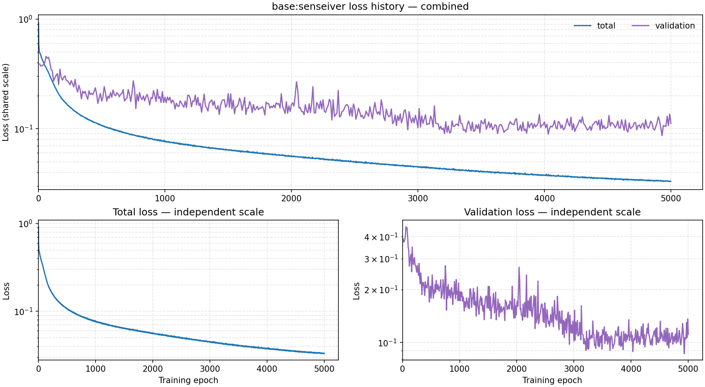
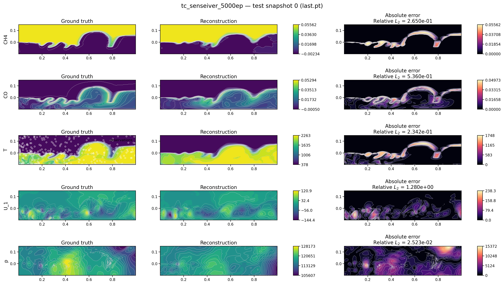
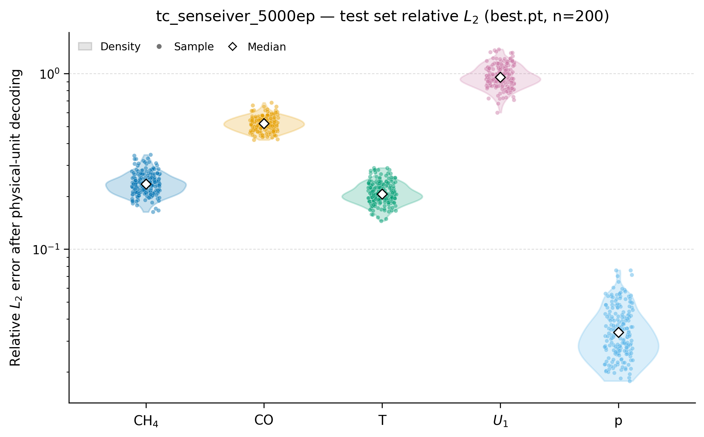
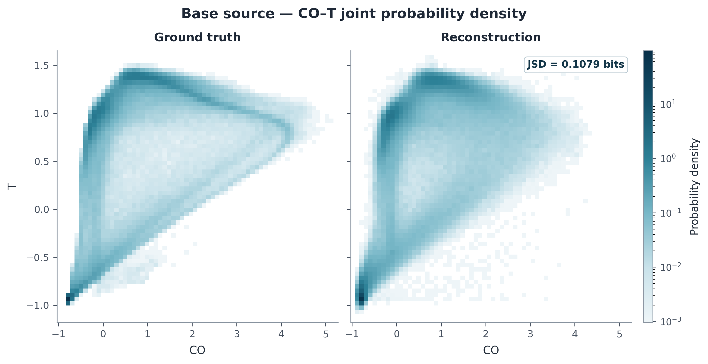
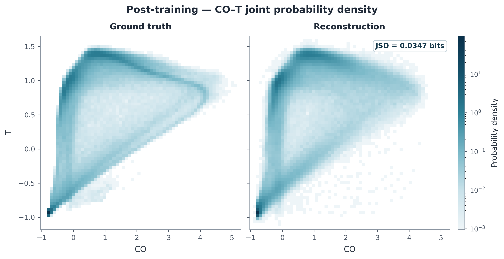
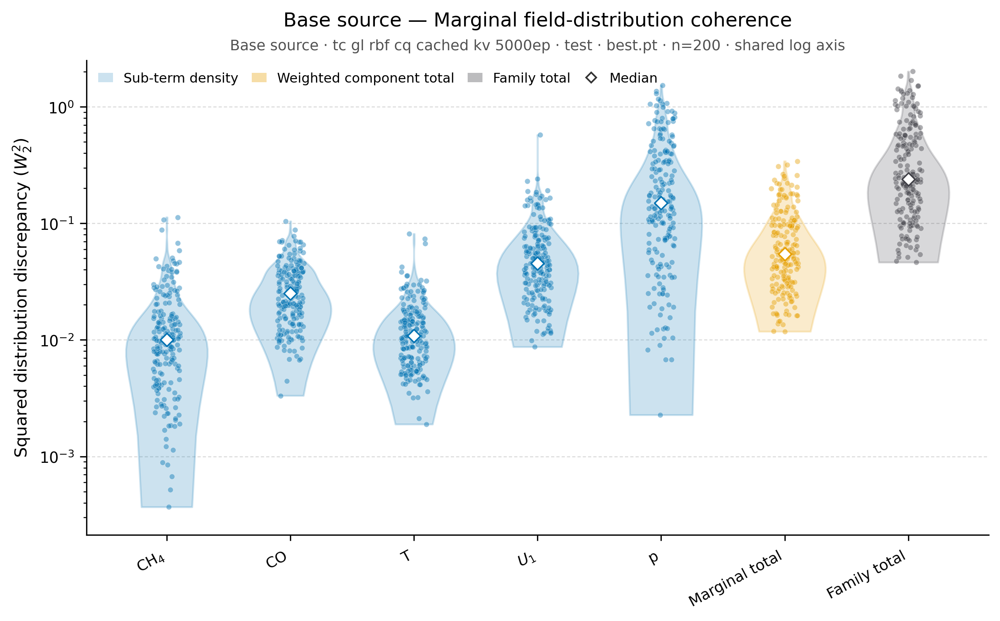
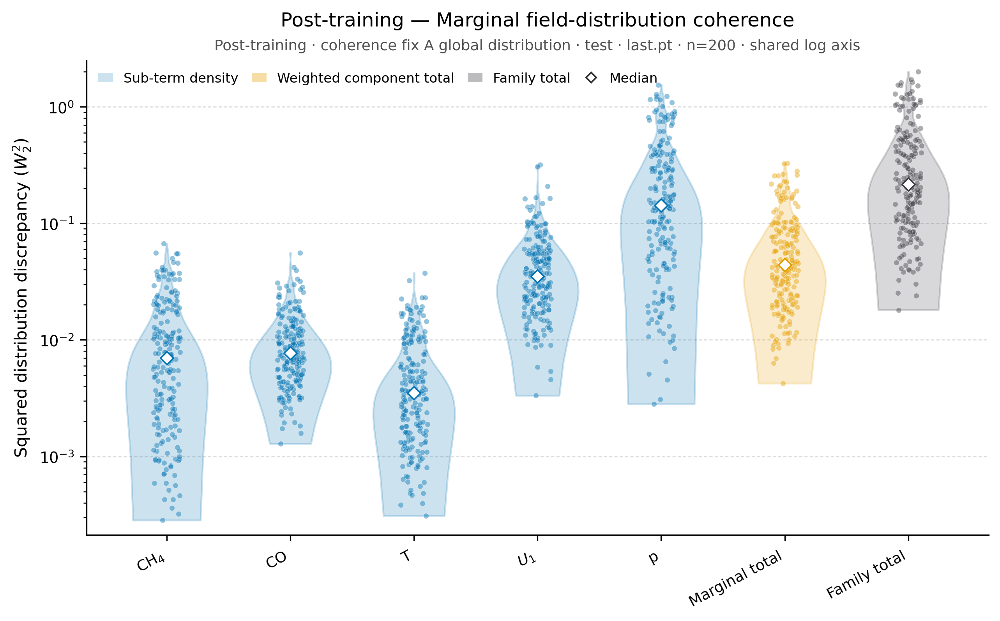
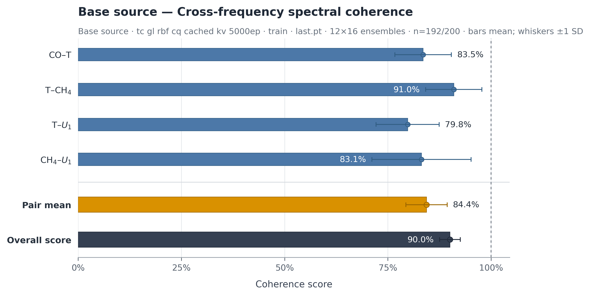
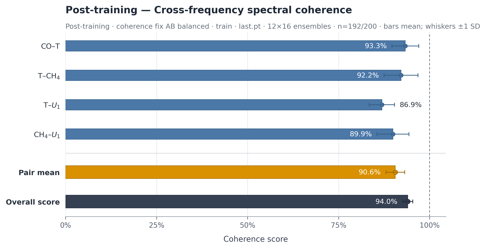

# PhyCoFlow Multi-Field Reconstruction

PhyCoFlow reconstructs complete physical states from sparse, multi-field measurements. The primary research workflow studies whether data-driven physical-coherence post-training improves the coherence of a reconstructed state while preserving the immutable source checkpoint and the supervised data contract.

The standard lifecycle is:

```text
dataset contract → case + sensors → shared model → base checkpoint
                                               ↓
                              coherence post-training → evaluation
```

Physics-informed training and historical compatibility routes are available, but remain explicit alternatives to this primary workflow.

## 0. Table of contents

- [1. Start here](#1-start-here)
- [2. Repository architecture](#2-repository-architecture)
- [3. Dataset contract](#3-dataset-contract)
- [4. Case workflow](#4-case-workflow)
- [5. Select and train a model](#5-select-and-train-a-model)
- [6. Coherence post-training](#6-coherence-post-training)
  - [6.1 Prepare a portable configuration](#61-prepare-a-portable-configuration)
  - [6.2 Validate and launch](#62-validate-and-launch)
- [7. Evaluation and local outputs](#7-evaluation-and-local-outputs)
  - [7.1 Single-snapshot reconstruction figure](#71-single-snapshot-reconstruction-figure)
  - [7.2 Multi-snapshot reconstruction statistics](#72-multi-snapshot-reconstruction-statistics)
  - [7.3 Multi-snapshot physical-coherence statistics](#73-multi-snapshot-physical-coherence-statistics)
    - [7.3.1 Global-distribution coherence](#731-global-distribution-coherence)
    - [7.3.2 Cross-spectrum coherence](#732-cross-spectrum-coherence)
- [8. Benchmarks and reproducibility](#8-benchmarks-and-reproducibility)
- [9. Contributing](#9-contributing)

## 1. Start here

Commands below run from this repository root. Install the shared package in a virtual environment or conda environment, then validate whichever local data payloads are present:

```bash
conda env create -f environment.yml
conda activate phycoflow_reconstruction
python -m pip install -e '.[dev]'
python scripts/data/validate_dataset.py --all
```

Datasets are intentionally local. Link a payload into the canonical catalog without copying it:

```bash
python scripts/data/link_dataset.py \
  --case brusselator \
  --source /absolute/path/to/brusselator.h5
```

The optional `operator` extra provides `neuraloperator` for GeoFNO and the FNO PointCloudFFM backbone. The `posttrain` extra provides ConFIG gradient balancing, and `legacy` provides the optional Demo50 neighbor-search path.

## 2. Repository architecture

The reusable implementation is under `src/phycoflow_reconstruction/`:

- `contracts.py` defines dataset, observation, reconstruction, loss, capability, coherence, and physics boundaries;
- `data/` handles payload adapters, normalization, splits, manifests, and sensor protocols;
- `models/` contains deterministic, generative, operator, flow, and isolated historical-compatibility adapters;
- `coherence/` contains reference banks, family composition, observation consistency, and the global-distribution, cross-spectrum, and topology families;
- `training/` owns base training, coherence/physics post-training, direct physics, checkpoints, rollout, previews, and monitoring;
- `evaluation/`, `physics/`, `config/`, and `cli.py` provide shared evaluation, case-independent physics interfaces, config composition, and command routing.

The point-cloud flow package keeps the low-level tensor core separate from the project adapter:

```text
models/flows/pointcloud/core/       model math, geometry, attention, priors,
                                   tensor training/reconstruction primitives
models/flows/pointcloud/runtime/   builder, EMA, checkpoint and tensor runtime
models/flows/pointcloud/adapters/  project contracts, lifecycle, registry glue
```

See [docs/architecture.md](docs/architecture.md) for dependency direction and [docs/models.md](docs/models.md) for model capabilities and stages.

Each `cases/<case>/` directory owns only scientific meaning and launch profiles: field metadata, physical diagnostics/providers, dataset selection, sensor protocols, coherence/physics settings, and a thin `run.py`. Generic models and trainers never import a named case.

Generic model fragments live once in `configs/models/`; shared runtime, optimization, evaluation, and checkpoint defaults live in `configs/defaults/`. Case launch profiles compose those fragments and carry only scientifically meaningful overrides. Configuration ownership and composition rules are described in [docs/configuration.md](docs/configuration.md).

## 3. Dataset contract

`datasets/` is a local catalog, not a place to commit normal payloads. Track the schema and reproducibility instructions, while keeping HDF5/PT/NumPy payloads, links, and derived caches local. The canonical contract requires a dense field state, coordinates, time/condition metadata, field order, logical shape, and declared train/validation/test split semantics. See:

- [datasets/README.md](datasets/README.md) for the catalog;
- [datasets/SCHEMA.md](datasets/SCHEMA.md) for the accepted HDF5/PT structure;
- [docs/reproducibility.md](docs/reproducibility.md) for normalization, lineage, and release rules.

Validate an individual payload or all known catalog entries:

```bash
python scripts/data/validate_dataset.py datasets/brusselator/brusselator.h5
python scripts/data/validate_dataset.py --all
```

Missing optional local payloads are reported by validation; they are never fabricated by the repository.

## 4. Case workflow

Choose a case and inspect its README, dataset config, sensor protocol, and base launch profiles:

```bash
cd cases/brusselator
python run.py validate --config configs/dataset.yaml
```

Sensor definitions live under `cases/<case>/configs/sensors/`. Build a fixed manifest when comparing runs:

```bash
python run.py build-manifest \
  --config configs/base/coordinate_mlp.yaml \
  --split validation --max-samples 8 \
  --output manifests/validation_sensors.json
```

Manifests are local/generated and should not be committed except for a small, immutable benchmark fixture explicitly covered by a contract.

## 5. Select and train a model

The registry preserves these public model names:

`coordinate_mlp`, `mlp_rbf`, `pinn`, `deeponet`, `senseiver`, `geofno`, `diffusion_pde`, `latent_fm`, `pointcloud_ffm`, and `gl_rbf_cq`.

Run a short base-training smoke from a case directory:

```bash
python run.py train-base \
  --config configs/base/coordinate_mlp.yaml \
  --override runtime.device=cpu \
  --max-steps 1
```

Normal training omits `--max-steps`. Point models consume sparse observation tokens; grid/operator models rasterize observations and their support mask. Diffusion and flow models retain their native noise/velocity objectives.

The tracked Senseiver example below shows the total training objective and fixed-validation loss over a completed 5,000-epoch turbulent-combustion base run. Each run writes its current `loss_history.png` at the run root.



DiffusionPDE supports two interchangeable denoising backbones. The maintained `configs/models/diffusion_pde.yaml` profile selects a time-conditioned, multiscale U-Net with configurable channel multipliers, residual depth, timestep embedding, coarse-level attention, attention heads, and dropout. The original three-convolution implementation remains available as the lightweight, checkpoint-compatible `plain_cnn` option:

```bash
# Maintained conditional U-Net profile.
python run.py train-base --config configs/base/diffusion_pde.yaml

# Select the legacy plain CNN without editing the shared model fragment.
python run.py train-base --config configs/base/diffusion_pde.yaml \
  --override model.backbone=plain_cnn
```

Both backbones use the same cosine noise schedule, noise-prediction loss, and deterministic DDIM-style reconstruction with observed values clamped after each sampling update. They require complete two-dimensional target grids. The U-Net uses considerably more accelerator memory, especially when attention is enabled; set the case-level training batch size accordingly.

Latent flow has an explicit two-stage lifecycle:

```bash
python run.py train-base --config configs/base/latent_fm_stage1.yaml
python run.py train-base --config configs/base/latent_fm_stage2.yaml \
  --override model.stage1_checkpoint=runs/<stage1>/<run-id>/checkpoints/best.pt
```

Stage 2 strictly loads and freezes the Stage-1 autoencoder. It is the sparse reconstruction source; Stage 1 is a prerequisite checkpoint only.

## 6. Coherence post-training

Post-training creates a child run from a completed, immutable base run. The selected source checkpoint is loaded strictly, while the dataset, model, observations, normalization, and provenance are inherited from the source run's `resolved_config.yaml`; the source run is hashed before and after training and is never modified.

### 6.1 Prepare a portable configuration

Keep reusable family definitions under `cases/<case>/configs/coherence/`, normal launch profiles under `cases/<case>/configs/posttrain/`, and matched readiness or ablation matrices under `cases/<case>/configs/readiness/`. A standard launch profile uses a common execution file plus a small scientific leaf file. Do not commit machine-specific absolute source paths: set `source_run: null` in the common file and supply the run at launch time.

The common file owns the source contract, optimizer, runtime, rollout, evaluation, and shared coherence compute budget. This compact template is suitable for a native completed run and can be adapted to another case by changing `<case>` and the numerical budgets:

```yaml
# cases/<case>/configs/posttrain/_common.yaml
stage: post_training
case: <case>
source_run: null
source_checkpoint: best.pt
inherit_base_config: true
source: {kind: native_run, allow_integration_source: false}

objectives:
  data_retention: {enabled: true, weight: 0.1}
  coherence: {enabled: true, weight: 1.0}

rollout: {steps: 2, solver: euler}
observation_consistency: {mode: endpoint_smooth, strength: 1.0, sigma: 0.05, schedule_power: 2.0, final_clamp: true, chunk_size: 4096}
trainable: {scope: full_model}

optimization: {epochs: 1000, batch_size: 16, train_fraction: 0.2, lr: 5.0e-5, weight_decay: 1.0e-6, grad_clip: 1.0, gradient_balance: weighted_sum, config_missing_behavior: error}
runtime: {seed: 42, device: cuda:0, deterministic: true, num_workers: 0, data_strategy: async_cpu, progress: true}
evaluation: {split: validation, max_samples: 32, query_points: 4096, generation_steps: 2, seed: 2027}
checkpointing: {enabled: true, every_epochs: 10, save_epoch_one: true, selection_metric: reconstruction_mse}
posttrain_fidelity: {max_relative_mse_increase: 0.05, behavior: report}

coherence:
  schedule: {start_epoch: 1, every_n_steps: 1, weight_warmup_epochs: 0, interval_rescale: false}
  compute_budget: {batch_size: 16, point_count: 4096, query_policy: fixed_shared, query_seed: 100045}
```

The leaf file owns the scientific hypothesis: enabled families, field names from the inherited dataset contract, component weights, target source, family balancing, and the experiment name. For example:

```yaml
# cases/<case>/configs/posttrain/global_distribution_paired.yaml
defaults: [_common.yaml]

coherence:
  family_balance: {mode: none}
  families:
    global_distribution:
      enabled: true
      weight: 1.0
      target_use: paired_supervised
      units: model_units
      fields: [<field_a>, <field_b>]
      reference_bank: {enabled: false}
      components:
        self: {enabled: true, weight: 1.0}
        mutual: {enabled: true, weight: 1.0, directions: 8, seed: 1234}
        cross: {enabled: true, weight: 1.0, directions: 16, top_fraction: 0.1, seed: 1234, include_axes: true, qmc: true}

output: {experiment_name: <case>_posttrain_global_distribution}
```

Use `target_use: paired_supervised` with `reference_bank.enabled: false` when every reconstruction is compared with its own dense target. Use `target_use: training_reference` with an enabled reference bank when matching an independently sampled training distribution; its `points_per_sample` must equal `coherence.compute_budget.point_count`. Cross-spectrum and topology require `query_policy: fixed_shared`; same-frequency cross-spectrum requires coherence batch size at least 2, cross-frequency requires at least 3, and `optimization.batch_size` must not be smaller than the coherence batch size. For a single family, `family_balance.mode: none` is the clear default; for multiple families with different raw scales, use `initial_grad_norm` and record its calibration settings.

### 6.2 Validate and launch

Run both commands from the repository root. The launcher resolves the config and source run relative to `cases/<case>/`, inherits the source contracts, validates the post-training schema, and checks the dataset before any optimization begins:

```bash
python cases/<case>/run.py validate \
  --config configs/posttrain/<profile>.yaml \
  --override source_run=runs/<base-experiment>/<run-id> \
  --override source_checkpoint=best.pt

python cases/<case>/run.py post-train \
  --config configs/posttrain/<profile>.yaml \
  --override source_run=runs/<base-experiment>/<run-id> \
  --override source_checkpoint=best.pt
```

Choose the checkpoint explicitly: `best.pt` starts from the best fixed-validation reconstruction, while `last.pt` starts from the final training state. Add `--override runtime.device=<device>` when the config's default device is unsuitable. A successful launch creates `cases/<case>/runs/<experiment_name>/<run-id>/` containing the resolved config, parent/checkpoint lineage and hashes, checkpoints, metrics, previews, and fidelity report. Use `--max-steps 1` only for an intentional smoke run; set `source.allow_integration_source=true` only when the source itself is explicitly an incomplete integration fixture.

Available coherence families are `global_distribution`, `cross_spectrum`, and `topology`; one leaf config may compose several families over the same differentiable reconstruction. The cleaned GL-RBF/CQ path follows this lifecycle while preserving state-dict keys, seeded behavior, cached-K/V execution, query microbatching, geometry/reconstruction caches, EMA state, and observation consistency.

For a physics post-training route, use a case that exposes a differentiable `PhysicsProvider` (currently Brusselator):

```bash
python run.py post-train \
  --config configs/posttrain/physics_periodic.yaml \
  --override source_run=runs/<base-experiment>/<run-id>
```

Direct PINN training is a separate route:

```bash
python run.py train-direct --config configs/direct_physics/pinn.yaml
```

## 7. Evaluation and local outputs

Evaluate any base or child run with a sensor config or fixed manifest:

```bash
python run.py evaluate-run \
  --run runs/<experiment>/<run-id> \
  --checkpoint best \
  --sensor-config configs/sensors/u_only_random.yaml \
  --split validation --max-samples 8 \
  --report-name validation
```

The evaluator records normalized/physical errors, observed/unobserved metrics, sample/query/sensor identities, diagnostics, timing, and provenance. Generated checkpoints, manifests, reports, previews, figures, caches, and histories stay under `cases/<case>/runs/` and are ignored by Git.

### 7.1 Single-snapshot reconstruction figure

From the repository root, the simple form is:

```bash
python cases/<case>/run.py visualize-run --run runs/<experiment>/<run-id>
```

With no optional arguments, this loads `best.pt`, selects snapshot `0` relative to the test split, and uses the sparse observation protocol and generation settings in `resolved_config.yaml`. It always reconstructs the complete grid and writes a 300-DPI PNG.

The fully explicit command used for the Senseiver example below is:

```bash
python cases/turbulent_combustion/run.py visualize-run \
  --run runs/tc_senseiver_5000ep/20260828T190145Z_fea0fc25 \
  --checkpoint last \
  --split test \
  --snapshot-index 0 \
  --generation-steps 4 \
  --device cuda:2 \
  --contour-levels 20 \
  --weight-selection configured
```

- `--snapshot-index` is relative to the selected split.
- Omit `--sensor-config` and `--sensor-manifest` to use the observation protocol recorded by the run. Supplying either option overrides or replays that protocol.
- `--contour-levels` controls both filled and thin grey contours. Colorbars are continuous with four labeled ticks.
- Figure size, spacing, and text scale adapt to the physical-domain aspect ratio and field count.
- A CUDA-memory warning appears before inference when the selected device may be tight; choose a different device with `--device`.

Outputs are stored under `evaluation/reconstruction_<split>_<snapshot>_<checkpoint>/`: `reconstruction.png`, `report.json`, `sensor_manifest.json`, `query_indices.pt`, and the portable plotting payload `reconstruction.npz`. The former duplicate `reconstruction.pt` is no longer written.



### 7.2 Multi-snapshot reconstruction statistics

Add `--eval-set` to render each field's physical-space relative $L_2$ distribution as a violin plot overlaid with individual sample points. The quick form is:

```bash
python cases/<case>/run.py visualize-run \
  --run runs/<experiment>/<run-id> --eval-set test
```

The fully explicit command used for the Senseiver example below is:

```bash
python cases/turbulent_combustion/run.py visualize-run \
  --run runs/tc_senseiver_5000ep/20260828T190145Z_fea0fc25 \
  --checkpoint best \
  --eval-set test \
  --eval-samples 200 \
  --generation-steps 4 \
  --device cuda:2 \
  --weight-selection configured
```

`--eval-set` accepts `train`, `validation`, or `test`. The default limit is 200 deterministic, evenly spaced samples across that split; request more with `--eval-samples 500` or the complete split with `--eval-samples all`. Statistical distribution plots use a logarithmic vertical scale by default; select the normal linear scale with `--stat-scale linear`. For snapshot datasets each sample is one snapshot; trajectory datasets are evaluated one trajectory at a time. The model and checkpoint load once while full-grid samples stream individually to bound memory.

Outputs are written under `evaluation/reconstruction_set_<split>_<checkpoint>/` and include the 300-DPI violin/scatter figure, summary report, per-sample CSV, reusable NPZ metrics, and streaming sensor manifest.

When the target is a post-training run, statistical evaluation also evaluates the exact source checkpoint recorded by the run lineage. The base and post-training models use identical split-relative samples, sensor selections, generation settings, seeds, and coherence definitions. Current-run figures keep their standard names, while each base-run figure is written beside its counterpart with a `-base` suffix, for example `relative_l2_violin.png` and `relative_l2_violin-base.png`; corresponding reconstruction and distribution figures share the same vertical limits, while cross-spectrum figures retain the common bounded 0–1 score axis. `comparison_report.json` records both checkpoints, matched-input hashes, shared limits, and artifact paths. Add `--no-base-comparison` only when the extra source-checkpoint evaluation is intentionally unnecessary.



### 7.3 Multi-snapshot physical-coherence statistics

Add `--eval-coherence` to the same set evaluation to calculate paired reconstruction-to-ground-truth coherence metrics alongside the default relative-$L_2$ results. The shortest command for both currently supported statistical coherence families is:

```bash
python cases/<case>/run.py visualize-run \
  --run runs/<experiment>/<run-id> \
  --eval-set test \
  --eval-coherence global_distribution cross_spectrum
```

Use one family name when only that evaluation is needed. `--eval-coherence` requires `--eval-set`, accepts `global_distribution`, `cross_spectrum`, or both, and writes each family into `evaluation/reconstruction_set_<split>_<checkpoint>/coherence/<family>/` so figures and numerical artifacts remain separated.

For a post-training target, the same command automatically adds a matched `-base` figure beside each standard post-training coherence figure. The base calculation uses the child run's coherence evaluation contract and the same selected samples, sensor observations, inference settings, and plot limits, so corresponding figures are directly comparable. A requested family configured in the post-training run evaluates the coherence quantity used during training; a requested but unconfigured family uses the repository's paired-ground-truth default and should be interpreted as an auxiliary diagnostic. Use `--no-base-comparison` to skip source-checkpoint evaluation.

#### 7.3.1 Global-distribution coherence

The fully explicit global-distribution command for the Senseiver example is:

```bash
python cases/turbulent_combustion/run.py visualize-run \
  --run runs/tc_senseiver_5000ep/20260828T190145Z_fea0fc25 \
  --checkpoint best \
  --eval-set test \
  --eval-samples 200 \
  --eval-coherence global_distribution \
  --stat-scale log \
  --generation-steps 4 \
  --device cuda:2 \
  --weight-selection configured
```

Global-distribution evaluation is calculated per snapshot and produces separate violin/scatter figures for marginal field distributions, pairwise field distributions, and joint top-tail distributions. Each figure includes its sub-terms, weighted component total, and family total. Use `--stat-scale linear` when a normal vertical scale is preferred; the default is logarithmic. The family directory also contains `metrics.csv`, `metrics.npz`, and `report.json`.

Add `--extraview-coherence` to render a dedicated ground-truth-versus-reconstruction joint-PDF figure for every field pair represented in `pairwise_field_distributions.png`:

```bash
python cases/<case>/run.py visualize-run \
  --run runs/<experiment>/<run-id> \
  --checkpoint last \
  --eval-set test \
  --eval-coherence global_distribution \
  --extraview-coherence
```

The extra views are written under `coherence/global_distribution/global_distribution_extra/`. Each 300-DPI figure compares ground-truth and reconstruction joint densities on shared axes, bins, and density normalization and marks the Jensen–Shannon divergence in bits, where `0` is identical and `1` is maximally separated. The default evaluation pools deterministic spatial samples from all 200 selected snapshots; larger or full-set evaluations automatically reduce points per snapshot to keep memory bounded without dropping snapshots. For post-training runs, standard filenames represent the assigned checkpoint and adjacent `-base` files represent its source checkpoint, with the same samples and visualization scales. CSV, NPZ, and JSON artifacts retain the probability masses, bin edges, sampling contract, and divergence values.

> **Extra-view support:** `--extraview-coherence` currently supports only `global_distribution`. Dedicated extra visualizations for `cross_spectrum` and `topology` are pending; the existing cross-spectrum statistical bar charts remain available through `--eval-coherence cross_spectrum`.

The CO–T example below compares the source `best.pt` checkpoint with the AB post-training `last.pt` checkpoint over the same 200 test snapshots.

<p align="center"> </p>

<p align="center"><em>Left: base source. Right: post-training checkpoint. Both figures share samples, bin edges, field axes, and density normalization.</em></p>

The paired example below compares the source `best.pt` checkpoint with the global-distribution post-training `last.pt` checkpoint over the same 200 test snapshots. Both figures use the same logarithmic vertical limits; the standard filename identifies the post-training result and the adjacent `-base` filename identifies its source counterpart.

<p align="center"> </p>

<p align="center"><em>Left: base source. Right: post-training checkpoint. Shared samples and vertical scale make the distributions directly comparable.</em></p>

#### 7.3.2 Cross-spectrum coherence

The fully explicit cross-spectrum command for the same checkpoint is:

```bash
python cases/turbulent_combustion/run.py visualize-run \
  --run runs/coherence_fix_AB_balanced/20260829T235221Z_b3b586c4 \
  --checkpoint last \
  --eval-set train \
  --eval-samples 200 \
  --eval-coherence cross_spectrum \
  --cross-spectrum-aggregation training_aligned \
  --generation-steps 2 \
  --device cuda:0 \
  --weight-selection configured
```

Cross-spectrum evaluation defaults to `--cross-spectrum-aggregation training_aligned`: it reads `coherence.compute_budget.batch_size` from the resolved configuration, divides the selected set into deterministic complete ensembles of that size, applies the same spectral calculations used during post-training to every ensemble, and reports their mean with ±1 standard-deviation whiskers. Incomplete trailing samples are excluded and recorded explicitly; for example, 200 selected snapshots with a coherence batch size of 16 produce 12 ensembles, 192 used samples, and 8 recorded as dropped. Use `--cross-spectrum-aggregation pooled` only when one all-snapshot diagnostic ensemble is intentionally required.

The horizontal-bar figures report same-frequency and cross-frequency agreement scores on a fixed linear range from 0 to 1, where 1 means exact spectral agreement; `--stat-scale` therefore does not alter these charts. Per-ensemble values, averaged raw mean-squared discrepancies, normalized scores, spread statistics, ensemble membership, and dropped sample IDs are retained in `metrics.csv`, `metrics.npz`, and `report.json`. If spectral-band energy is enabled in the run's coherence configuration, its figure is generated in the same family directory.

The paired example below compares the source `last.pt` checkpoint with the AB post-training `last.pt` checkpoint over the same 12 training ensembles. Both figures use the same samples, graph, field pairs, and bounded score axis; the whiskers show ±1 standard deviation across ensembles.

<p align="center"> </p>

<p align="center"><em>Left: base source. Right: post-training checkpoint. The cross-frequency pair mean increases from 84.4% to 90.6% under the training-aligned estimator.</em></p>

> **Pending topology evaluation:** the topology coherence family is available for training and post-training objectives, but its intuitive set-level statistical evaluation and visualization are intentionally pending. That work will be refined as a separate task before `topology` is exposed through `visualize-run --eval-coherence`.

During training, the fixed validation objective and qualitative reconstruction use independent `evaluation.preview.loss_every_epochs` and `reconstruct_every_epochs` cadences. Validation loss is added to `loss_history.png` and selects `best.pt`; periodic recovery writes only `last.pt`, plus explicitly requested epoch checkpoints. Re-render a portable preview payload with:

```bash
python scripts/visualization/training_reconstruction_preview.py \
  --payload cases/<case>/runs/<experiment>/<run-id>/evaluation/training_preview/latest_reconstruction.npz
```

Run the complete local model smoke matrix on GPU 0 when available (or pass `--device cpu`):

```bash
python scripts/smoke/models.py --device cuda:0
```

This matrix uses tiny synthetic inputs, one loss/backward/update, and one reconstruction step. It is not a performance benchmark and is not required by cloud CI.

## 8. Benchmarks and reproducibility

`benchmarks/` tracks protocols, canonical configs, source scripts, and only small immutable fixtures or concise validation summaries. Routine telemetry, HTML/JSON/CSV reports, large manifests, plots, and run summaries are generated locally and ignored. Use [benchmarks/README.md](benchmarks/README.md) for the reproduction contract and [docs/provenance.md](docs/provenance.md) for pinned upstream references and compatibility provenance.

The one-step integration workflow is available as:

```bash
bash scripts/smoke/reproduce_brusselator_integration.sh
```

## 9. Contributing

Start with [CONTRIBUTING.md](CONTRIBUTING.md), then read the architecture and configuration docs before adding code. Work on a task branch, keep datasets and runs local, add contract tests for changed boundaries, and open a PR to `main`. The local acceptance checks are:

```bash
ruff check src tests scripts cases benchmarks
pytest
```

GPU smoke, long experiments, and formal benchmark regeneration are local acceptance activities rather than mandatory GitHub CI jobs.
