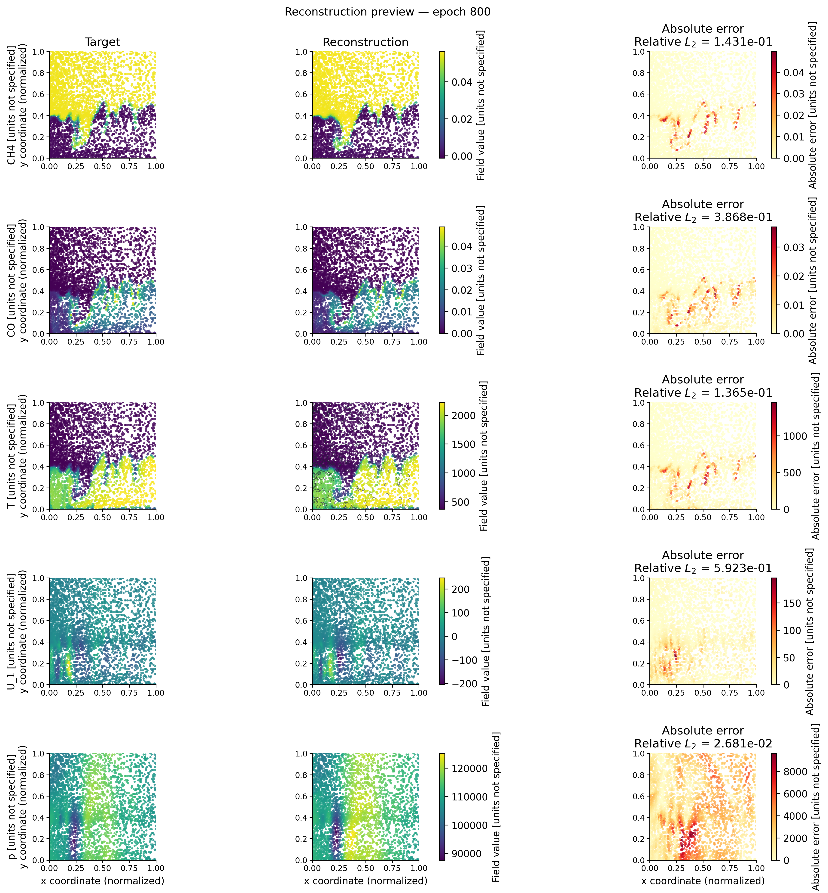
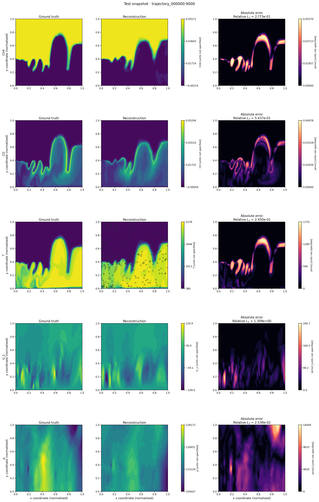
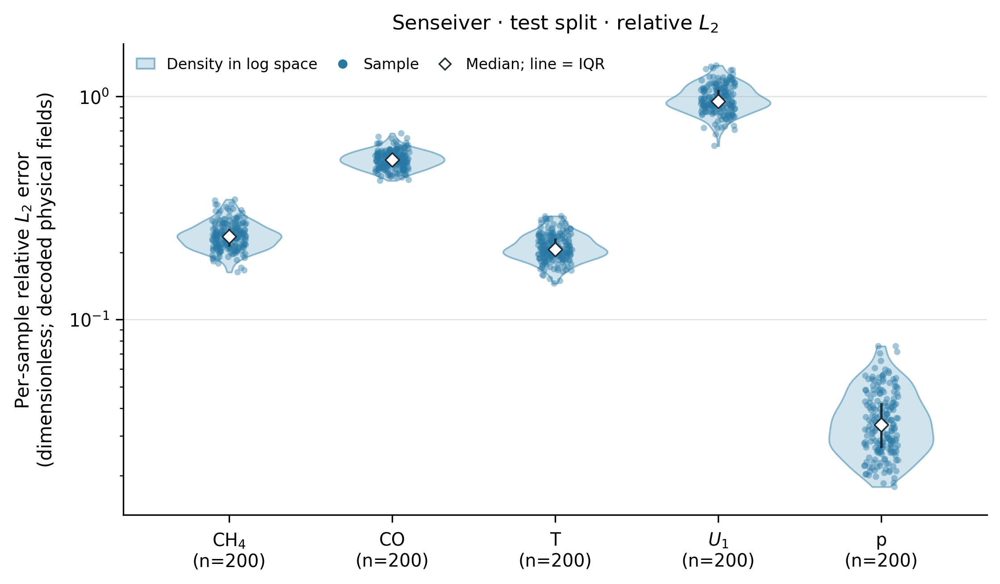
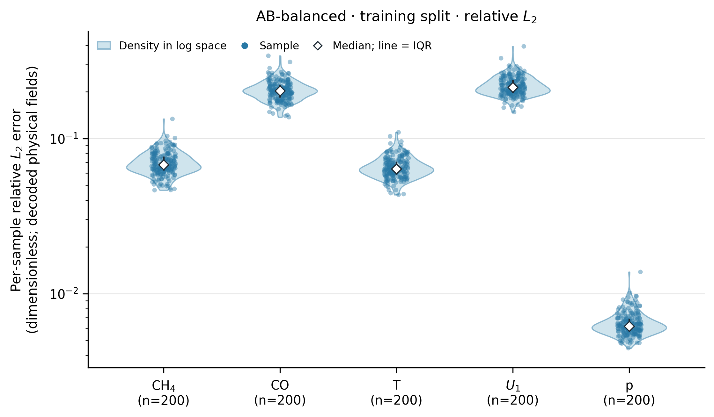

# Reconstruction visualization examples

These figures are rendered from pinned, read-only payloads under `source/`. They
do not load checkpoints or run inference. PNGs are provided for quick review;
PDF companions are retained. The two sparse-cloud snapshot SVGs are omitted
from the examples because their thousands of editable point glyphs make them
large; the render commands still generate SVG on demand.

## Fixed training preview



- **Source run:** `coherence_fix_ABC_sliced_persistence_formal_5000ep_gpu1/20260924T030724Z_4208231c`
- **Preview state:** epoch 800, global step 30,400; configured evaluation weights; two generation steps.
- **Split and sample:** validation, `trajectory_000000:8000`.
- **Interpretation:** qualitative fixed-sample preview, not a split-level score. This stored payload contains 4,096 sampled query locations from the 100×403 dataset grid, so the panels show a sparse point cloud. Its coordinates are normalized and the resolved field units are unspecified.
- **Pinned payload SHA-256:** `f114765efb2f15451c2b9d960f465411ffd21cbcd3cb4b50aa747c63a33b20c5`.
- **Other pinned metadata:** `source/abc_formal_epoch800/latest_metrics.json`, `figure_contract.md`, and `resolved_config.yaml`.
- **Retained formats:** PNG and PDF; the generated SVG is omitted from this example for size.

Render from the repository root:

```bash
rtk env CUDA_VISIBLE_DEVICES= OMP_NUM_THREADS=1 MKL_NUM_THREADS=1 MPLBACKEND=Agg \
  python scripts/visualization/training_reconstruction_preview.py \
  --payload cases/turbulent_combustion/diagnostics/reconstruction/source/abc_formal_epoch800/reconstruction.npz \
  --output-stem cases/turbulent_combustion/diagnostics/reconstruction/abc_formal_epoch800_preview \
  --epoch 800
```

## Senseiver full-grid snapshot



- **Source run:** `tc_senseiver_5000ep/20260828T190145Z_fea0fc25`.
- **Checkpoint:** `checkpoints/best.pt`, configured evaluation weights.
- **Split and sample:** test, index 0, `trajectory_000000:9000`; full 100×403 dataset grid.
- **Interpretation:** one saved full-grid snapshot, not an aggregate. The legacy payload stores normalized coordinates and declares field units as unknown; the renderer labels both accordingly. Target and reconstruction share a field scale per field; absolute error starts at zero and is shown in the stored field-value units.
- **Pinned payload SHA-256:** `563a04cf57d4ac71b3ddc7e2c6ad61d2566b886608a5ce6d23bb9a953f447597`.
- **Pinned provenance:** `source/senseiver_best_sample9000/report.json` and `resolved_config.yaml`.
- **Retained formats:** PNG and PDF; the generated SVG is omitted from this example for size.

Render from the repository root:

```bash
rtk env CUDA_VISIBLE_DEVICES= OMP_NUM_THREADS=1 MKL_NUM_THREADS=1 MPLBACKEND=Agg \
  python -c 'from pathlib import Path; from phycoflow_reconstruction.evaluation.reconstruction_visualization import render_reconstruction_payload; render_reconstruction_payload(Path("cases/turbulent_combustion/diagnostics/reconstruction/source/senseiver_best_sample9000/reconstruction.npz"), Path("cases/turbulent_combustion/diagnostics/reconstruction/senseiver_best_sample9000.png"), title="Test snapshot · trajectory_000000:9000", field_units=("unknown",) * 5)'
```

## Senseiver test-set fidelity



- **Source run:** `tc_senseiver_5000ep/20260828T190145Z_fea0fc25`.
- **Checkpoint:** `checkpoints/best.pt`, configured evaluation weights; four generation steps.
- **Split and selection:** test split; 200 evenly spaced samples from 1,000 available snapshots.
- **Metric:** per-sample, per-field relative L2 after decoding fields to physical values. The error is dimensionless; the log axis shows its positive distribution.
- **Interpretation:** one base-run test-set distribution, not a source/post comparison.
- **Pinned metrics SHA-256:** `4aed492c224b25a894ed524653e61132c1979affebcdf683b601f9e7e2016a87`.
- **Pinned provenance:** `source/senseiver_test_best/report.json`, `relative_l2.csv`, and `resolved_config.yaml`.

Render from the repository root:

```bash
rtk env CUDA_VISIBLE_DEVICES= OMP_NUM_THREADS=1 MKL_NUM_THREADS=1 MPLBACKEND=Agg \
  python -c 'from pathlib import Path; from phycoflow_reconstruction.evaluation.reconstruction_set import render_reconstruction_set_distribution; render_reconstruction_set_distribution(Path("cases/turbulent_combustion/diagnostics/reconstruction/source/senseiver_test_best/relative_l2.npz"), Path("cases/turbulent_combustion/diagnostics/reconstruction/senseiver_test_best_relative_l2.png"), title="Senseiver · test split · relative $L_2$", scale="log")'
```

## AB-balanced training-set fidelity



- **Source run:** `coherence_fix_AB_balanced/20260829T235221Z_b3b586c4`.
- **Checkpoint:** `checkpoints/last.pt`, configured evaluation weights.
- **Split and selection:** train split; 200 evenly spaced samples from 8,000 available snapshots.
- **Metric:** per-sample, per-field relative L2 after decoding to the declared physical fields; the plotted metric is dimensionless. The violin density is estimated in log space, and dots show the saved samples.
- **Interpretation:** post-training distribution only. The source/base `relative_l2.npz` was not persisted, so this refreshed figure is not a matched source-versus-post comparison. Existing source/base images elsewhere remain historical artifacts.
- **Pinned metrics SHA-256:** `f150e1fea9e42587e6f6ec1806f17dbc89dd9145cf83a0e431b09a579771914e`.
- **Pinned provenance:** `source/ab_balanced_train_last/report.json`, `comparison_report.json`, `relative_l2.csv`, and `resolved_config.yaml`.

Render from the repository root:

```bash
rtk env CUDA_VISIBLE_DEVICES= OMP_NUM_THREADS=1 MKL_NUM_THREADS=1 MPLBACKEND=Agg \
  python -c 'from pathlib import Path; from phycoflow_reconstruction.evaluation.reconstruction_set import render_reconstruction_set_distribution; render_reconstruction_set_distribution(Path("cases/turbulent_combustion/diagnostics/reconstruction/source/ab_balanced_train_last/relative_l2.npz"), Path("cases/turbulent_combustion/diagnostics/reconstruction/ab_balanced_train_last_relative_l2.png"), title="AB-balanced · training split · relative $L_2$", scale="log")'
```
