# Turbulent-combustion A+B+C co-post-training: completed 5,000-epoch example

This report is a worked example of the repository's standard reconstruction and coherence post-processing workflow. It compares the completed GL-RBF/CQ A+B+C post-training run with the source checkpoint from which it started, using the selected `best.pt` checkpoint for the main result. A is global distribution, B is cross-spectrum coherence, and C is sliced cubical-persistence topology coherence. All numbers below come from saved evaluation reports or the paired CSVs in [this example's assets](assets/); the compact machine-readable summary is [metrics.json](metrics.json).

## Result at a glance

On 64 matched **test** snapshots, A's mean discrepancy falls **15.80%** and C's mean persistence discrepancy falls **66.44%**. B's weighted spectral discrepancy rises **20.80%**, so the three coherence families do not all improve on held-out data. Physical per-field relative L2 improves slightly for CH4 and pressure, and worsens for CO, temperature, and U₁. The strongest field tradeoff is CO: **0.4943 → 0.5123** (+3.65%). The same broad pattern appears on the 64-snapshot validation set, although B improves there. These are descriptive results from one trajectory and one selected checkpoint, not uncertainty intervals or evidence that every snapshot improves.

| Matched 64-snapshot metric | Validation source → A+B+C | Validation change | Test source → A+B+C | Test change | Preferred direction |
|---|---:|---:|---:|---:|---|
| A: global-distribution family discrepancy | 0.42512 → 0.36583 | −13.95% | 0.41239 → 0.34724 | −15.80% | Lower |
| B: cross-spectrum weighted discrepancy | 0.01722 → 0.01591 | −7.65% | 0.02262 → 0.02732 | **+20.80%** | Lower |
| B: bounded coherence score | 0.65427 → 0.69810 | +4.38 percentage points | 0.66020 → 0.64365 | **−1.66 percentage points** | Higher |
| C: topology family discrepancy | 0.01421 → 0.00451 | −68.27% | 0.01439 → 0.00483 | −66.44% | Lower |

The three family discrepancies have different definitions and scales; the table compares each family with its own source value. It does not rank the families by raw magnitude or infer their gradient contribution during training. The bounded B score is a separate agreement measure, so its change is reported in percentage points.

## Provenance and evaluation contract

| Item | Recorded value |
|---|---|
| Source model | `cases/turbulent_combustion/runs/tc_gl_rbf_cq_cached_kv_5000ep/20260826T212231Z_7b68c461/checkpoints/last.pt` |
| Source checkpoint SHA-256 | `03f2f45b966a00850cc45c011b4cf1cd644b9408de355324fec8dc434a84a810` |
| A+B+C run | `cases/turbulent_combustion/runs/coherence_fix_ABC_sliced_persistence_formal_5000ep_gpu1/20260924T030724Z_4208231c` |
| Completion and selection | `status.json=completed` at epoch 5,000; `best.pt` is global step 114,950, or epoch 3,025 at 38 steps/epoch |
| Selected checkpoint SHA-256 | `3aed57d2e86376e11d205d167eee86298d588aca5a4400a10f3cac9aa6e1dd48` |
| Main comparison | `best.pt` against the source's `last.pt`, configured evaluation weights, generation steps 2, seed 2027, matched sensor manifest and dataset fingerprint |
| Samples | 64 equally spaced snapshots from validation frames 8,000–8,999 and 64 from test frames 9,000–9,999; all are from `trajectory_000000` |
| Coherence query | 4,096 fixed shared points; B uses two deterministic 32-snapshot ensembles; C uses the configured 32 × 128 raster reconstructed from those points |
| Training profile | 5,000 epochs, optimizer batch 32, training fraction 0.15, 32 coherence samples per update; [tracked profile](../../../cases/turbulent_combustion/configs/readiness/ABC_sliced_persistence_formal_5000ep_gpu1.yaml) and the run's `resolved_config.yaml` |

The source run has `model_ema_eval=true`, while the A+B+C run has `model_ema_eval=false`. Thus the standard `configured` comparison evaluates the source's EMA weights against the post-trained live weights. A separate live-versus-live L2 check below shows how much this policy difference affects field errors; the coherence comparisons remain the standard configured-weight comparison. The post-training run started from the source checkpoint's live model state, so the default comparison should be read as a comparison of the two runs' configured evaluation outputs, not a controlled estimate of the training update alone.

## Field reconstruction quality

The following values are the mean of **per-snapshot physical-unit relative L2** for each field, computed from paired 64-row CSVs. Each snapshot contributes once; the result is not the square root of pooled normalized MSE. “Improved” counts snapshots for which the A+B+C error is strictly below the source configured-weight error. The source-live column repeats inference with `--weight-selection live` on the same samples and sensors.

| Test field | Source configured | Source live | A+B+C live | Change vs configured | Change vs live | Improved snapshots vs configured |
|---|---:|---:|---:|---:|---:|---:|
| CH4 | 0.221184 | 0.221599 | 0.220134 | −0.47% | −0.66% | 32/64 |
| CO | 0.494305 | 0.494059 | 0.512330 | **+3.65%** | **+3.70%** | 18/64 |
| T | 0.184487 | 0.185283 | 0.186752 | +1.23% | +0.79% | 25/64 |
| U₁ | 1.036993 | 1.046993 | 1.041279 | +0.41% | −0.55% | 33/64 |
| p | 0.039261 | 0.039170 | 0.038427 | −2.13% | −1.90% | 34/64 |

| Validation field | Source configured → A+B+C live | Change vs configured | Change vs source live |
|---|---:|---:|---:|
| CH4 | 0.218952 → 0.217874 | −0.49% | −0.78% |
| CO | 0.487502 → 0.502456 | **+3.07%** | **+3.70%** |
| T | 0.179738 → 0.181382 | +0.91% | +0.40% |
| U₁ | 1.022852 → 1.030222 | +0.72% | +0.68% |
| p | 0.040035 → 0.039119 | −2.29% | −1.78% |

| Source, test relative L2 distribution | A+B+C, test relative L2 distribution |
|---|---|
| 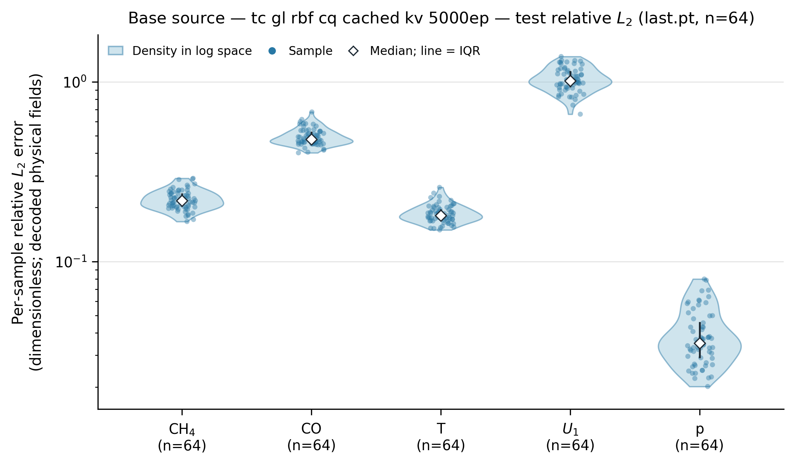 | 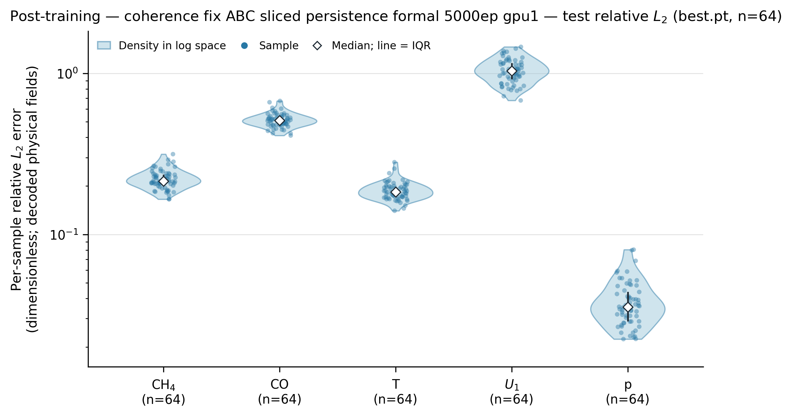 |

These distributions expose the CO regression and the large U₁ error more clearly than a single aggregate reconstruction score. The [validation source](assets/validation_relative_l2_violin_base.png) and [validation A+B+C](assets/validation_relative_l2_violin_post.png) versions are also saved. Raw paired values are in [test configured source](assets/test_relative_l2_base.csv), [test source live](assets/test_relative_l2_base_live.csv), [test A+B+C](assets/test_relative_l2_post.csv), and the corresponding `validation_*.csv` files in `assets/`.

### One physical-coordinate reconstruction

The example below uses test split index 500 for both checkpoints, with the same saved sensor manifest and two generation steps. It is a qualitative field view; the 64-snapshot tables above carry the quantitative conclusion. Each standard reconstruction figure chooses its own colorbar limits, so compare the labeled relative L2 values and physical coordinates rather than equal colors across the two figures.

| Source, test snapshot 500 | A+B+C, the same snapshot |
|---|---|
| 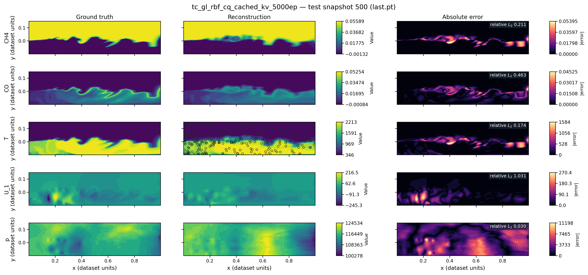 | 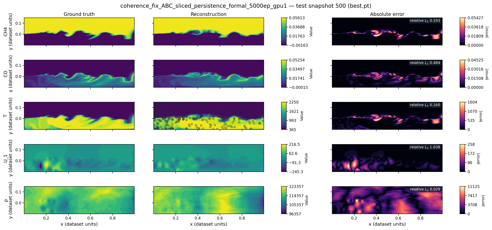 |

## A: global-distribution coherence

The test family discrepancy decreases **0.41239 → 0.34724** (−15.80%); joint top-tail discrepancy decreases **0.25321 → 0.22030** (−13.00%). All five test marginal discrepancy means improve; CO falls **0.03139 → 0.01055** (−66.39%) and T falls **0.01295 → 0.00500** (−61.43%). The CO–T pairwise discrepancy falls **0.02141 → 0.00737** (−65.57%). These statistics describe distribution matching across reconstructed query points, not pixelwise fidelity, which is why CO can improve here while its relative L2 worsens.

| Source marginals | A+B+C marginals |
|---|---|
| 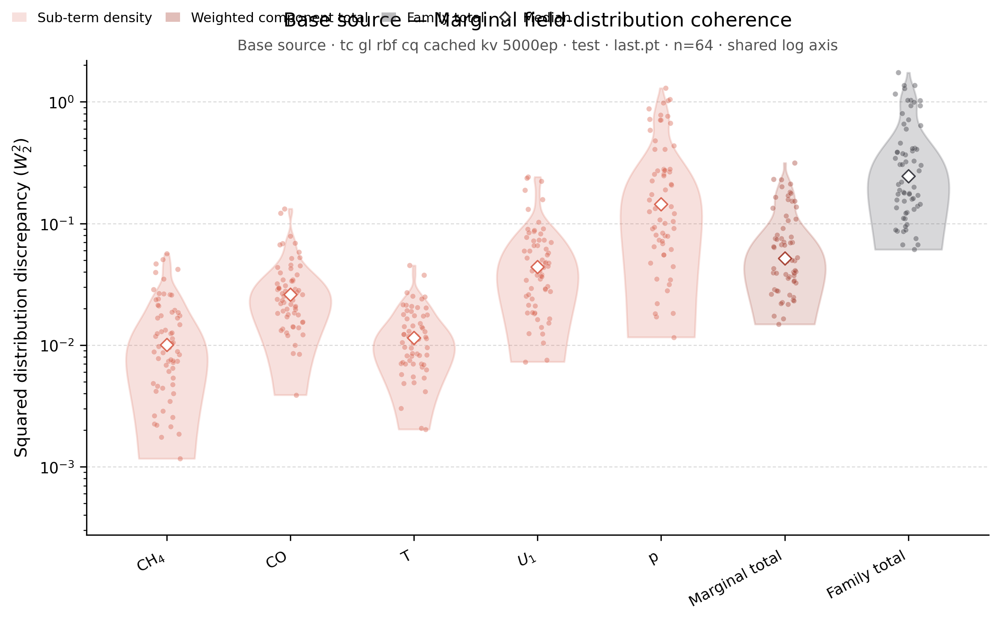 | 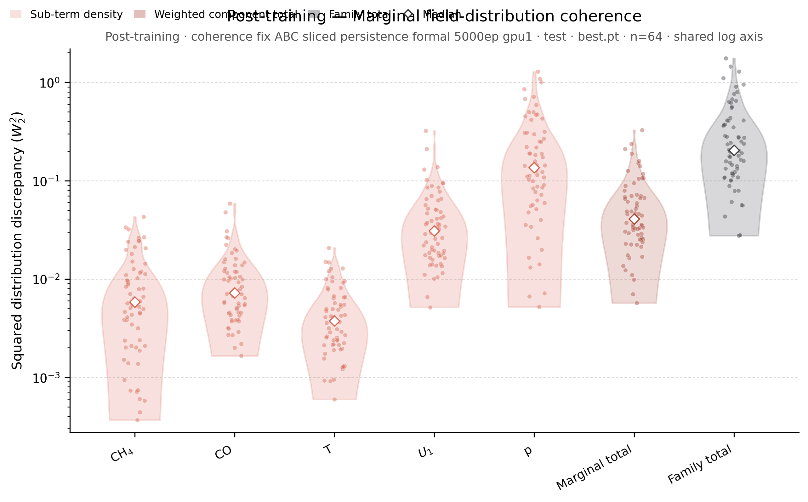 |

| Source field-pair distributions | A+B+C field-pair distributions |
|---|---|
| 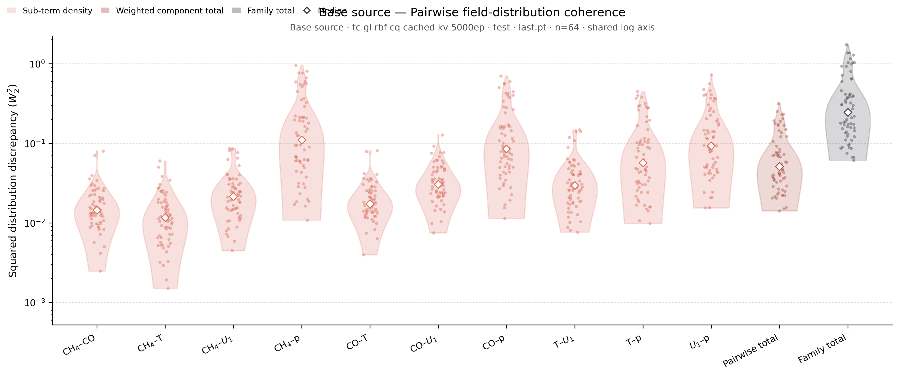 | 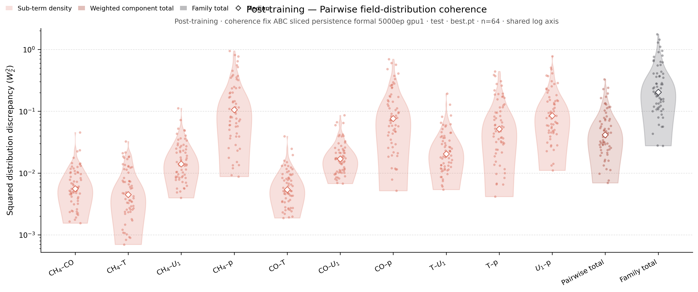 |

The standard suite also includes [source](assets/joint_top_tail_distributions_base.png) and [A+B+C](assets/joint_top_tail_distributions_post.png) top-tail figures. The full run-local suite contains per-pair joint PDFs and the underlying family report and CSV.

## B: cross-spectrum coherence

Validation improves in weighted discrepancy (**0.01722 → 0.01591**, −7.65%), but test worsens (**0.02262 → 0.02732**, +20.80%). On test, same-frequency discrepancy rises **0.00904 → 0.00961** (+6.36%) and cross-frequency discrepancy rises **0.01358 → 0.01771** (+30.40%). The test bounded score drops **0.66020 → 0.64365**, and three of the four cross-frequency field-pair scores decrease. The spectral result therefore does not support a generalization claim for B from this selected checkpoint.

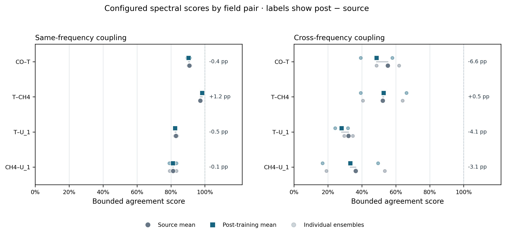

| Source same-frequency structure | A+B+C same-frequency structure |
|---|---|
| 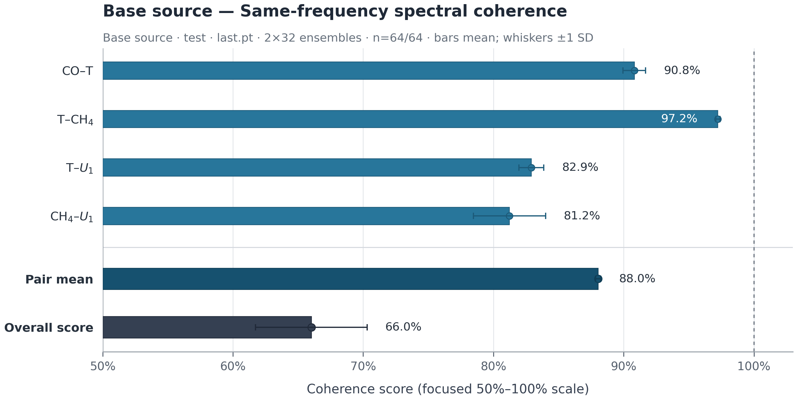 | 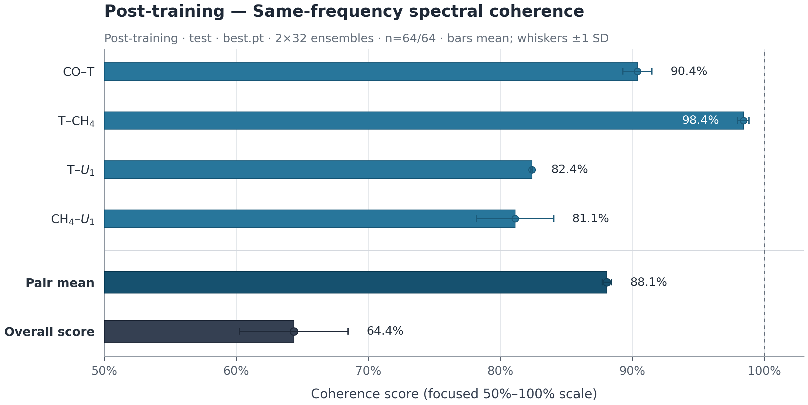 |

The standard test outputs also include [source](assets/cross_frequency_coherence_base.png) and [A+B+C](assets/cross_frequency_coherence_post.png) cross-frequency matrices, [source](assets/spectral_band_profiles_base.png) and [A+B+C](assets/spectral_band_profiles_post.png) band-energy profiles, and the [paired band-error view](assets/cross_band_error.png). The matrices use matching aspect ratios and scales within each paired view. The B estimate averages two deterministic 32-snapshot ensembles, so treat its test–validation difference as a finding to investigate rather than a population-level certainty.

## C: topology coherence

The test sliced-persistence family discrepancy decreases **0.01439 → 0.00483** (−66.44%); self CO/T persistence decreases **0.01189 → 0.00365** (−69.32%), and mutual CO–T line persistence decreases **0.00250 → 0.00118** (−52.75%). The family total improves on **62/64** test snapshots. Validation shows a similar total reduction of **68.27%**. These are the actual configured persistence distances, averaged per snapshot before the outer family weight.

| Source persistence distances | A+B+C persistence distances |
|---|---|
| 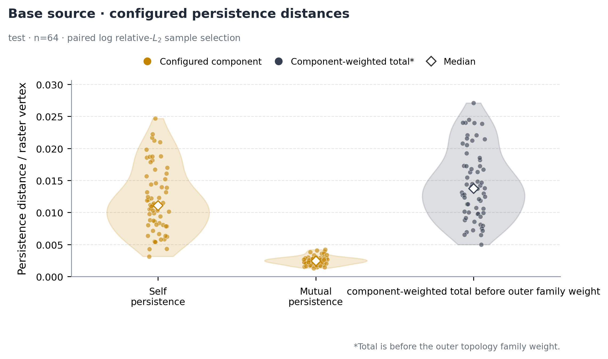 | 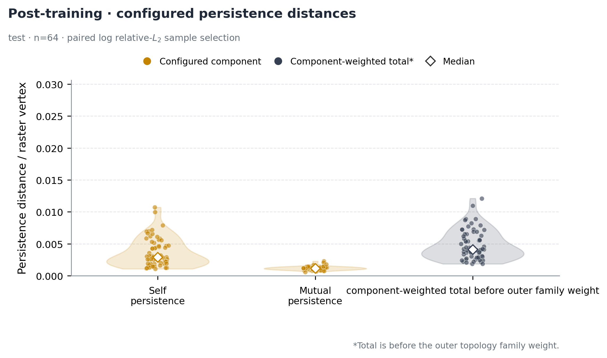 |

| Source Betti-curve diagnostics | A+B+C Betti-curve diagnostics |
|---|---|
| 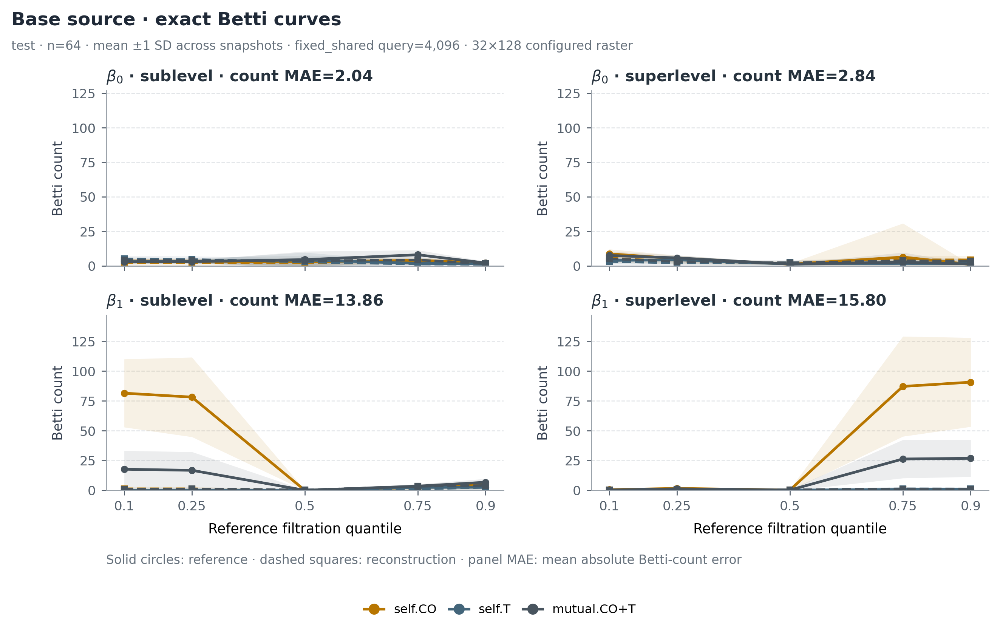 | 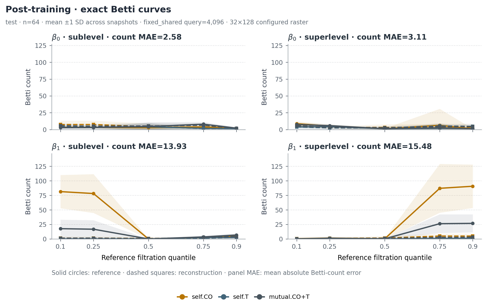 |

| Source configured-raster topology | A+B+C configured-raster topology |
|---|---|
| 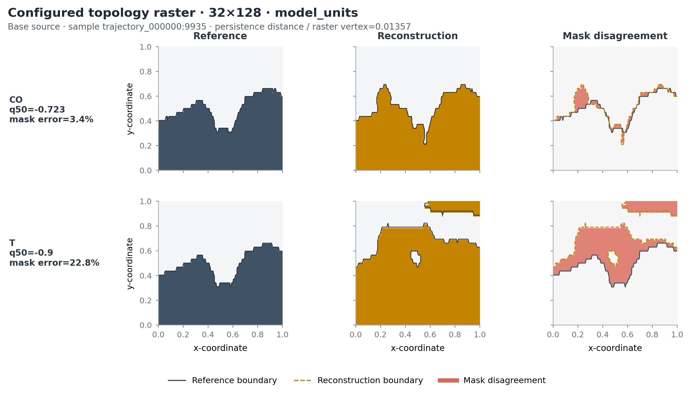 | 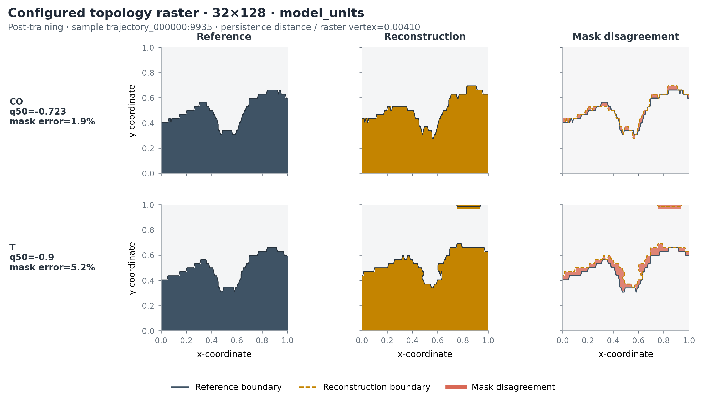 |

The [CO source](assets/topology_diagram_CO_base.png), [CO A+B+C](assets/topology_diagram_CO_post.png), [T source](assets/topology_diagram_T_base.png), and [T A+B+C](assets/topology_diagram_T_post.png) persistence-diagram views give concrete filtration examples. C evaluates the trained **4,096-point fixed query selector**, rasterized to **32 × 128**; this is distinct from the dataset's 100 × 403 native grid. Betti-count curve errors are explanatory diagnostics, not the sliced-persistence objective itself, and individual Betti errors can worsen despite the large reduction in the persistence distance.

## Training history and checkpoint choice

The job completed 5,000 epochs, but the scientifically selected checkpoint is **epoch 3,025**, not `last.pt`. The fixed-validation selection gate accepted it with normalized MSE **0.48973 → 0.44752** (−8.62%) against its internal source baseline and no field exceeding the configured **5% relative-MSE increase** allowance. At epoch 5,000 the same fixed panel reports normalized MSE **0.53668** (+9.59% from the source), and CO, U₁, and p each breach that field allowance. Thus the final training state is not the reported result. The 64-snapshot test L2 table and the fixed selection panel use different sample sets and different aggregation, so their percentages should not be interchanged.

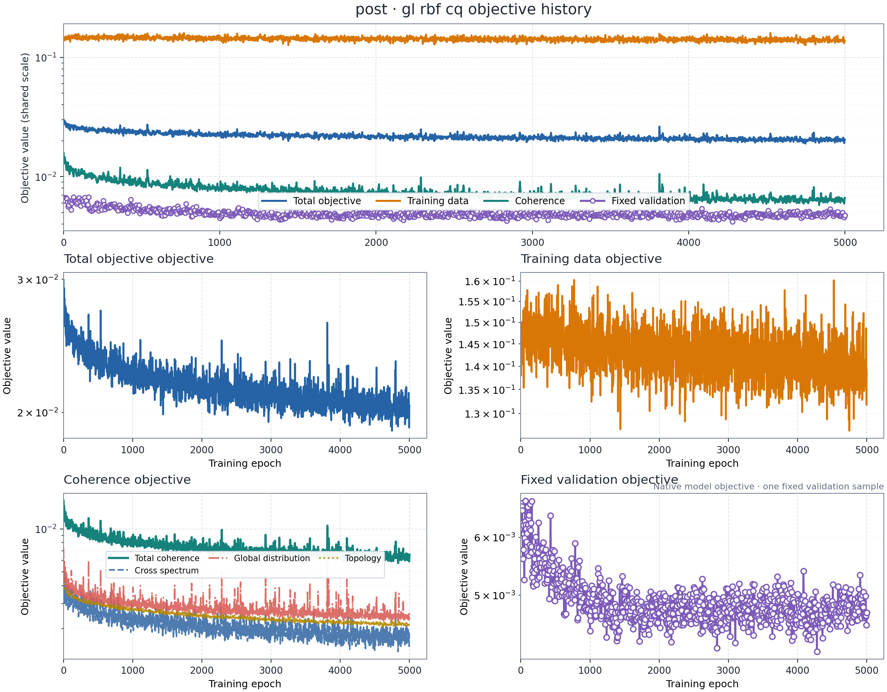

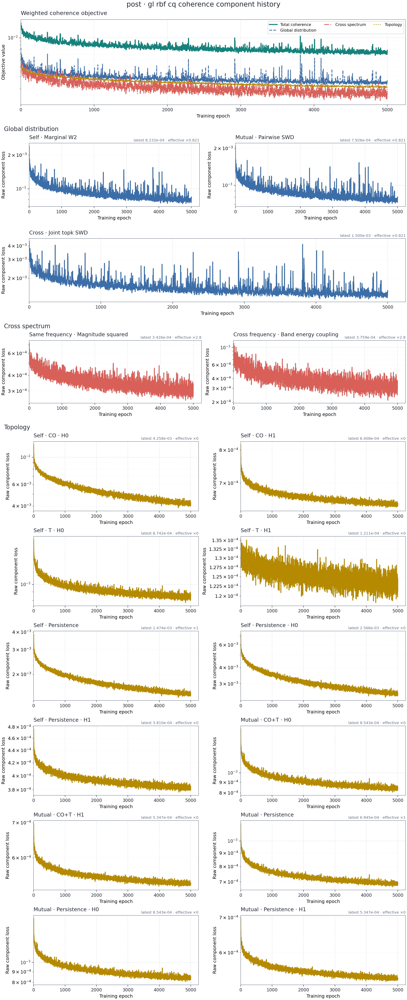

These are operational traces, not held-out quality metrics. Read the family-specific validation and test reports above to judge the selected checkpoint; do not infer cross-family gradient contribution from their plotted loss magnitudes.

## Reproduce the standard post-processing

Run these from the repository root in the project's Python environment. `--run` is relative to `cases/turbulent_combustion/`; outputs are written under that run's `evaluation/` directory. Use `best` for the selected post-training checkpoint, keep `training_aligned` for the configured B aggregation, and evaluate both splits to see the generalization difference. The run-local `comparison_report.json` records the matched sensor manifest, query contracts, sample IDs, generation steps, and source checkpoint used by the automatic paired comparison.

```bash
RUN=runs/coherence_fix_ABC_sliced_persistence_formal_5000ep_gpu1/20260924T030724Z_4208231c
BASE=runs/tc_gl_rbf_cq_cached_kv_5000ep/20260826T212231Z_7b68c461

python cases/turbulent_combustion/run.py visualize-run \
  --run "$RUN" --checkpoint best --split test --snapshot-index 500 --device cuda:1

python cases/turbulent_combustion/run.py visualize-run \
  --run "$RUN" --checkpoint best --eval-set validation --eval-samples 64 \
  --eval-coherence global_distribution cross_spectrum topology \
  --cross-spectrum-aggregation training_aligned --extraview-coherence --device cuda:1

python cases/turbulent_combustion/run.py visualize-run \
  --run "$RUN" --checkpoint best --eval-set test --eval-samples 64 \
  --eval-coherence global_distribution cross_spectrum topology \
  --cross-spectrum-aggregation training_aligned --extraview-coherence --device cuda:1

python cases/turbulent_combustion/run.py render-history --run "$RUN"
```

For a source-only L2 sensitivity check using the **same 64 sample IDs and two generation steps**, use `--run "$BASE" --checkpoint last --eval-set test --eval-samples 64 --generation-steps 2 --weight-selection live`; the CSV in this example was saved before restoring the source run's default configured-weight evaluation. To reproduce the paired snapshot shown above, use the post-trained snapshot's `sensor_manifest.json` with `--sensor-manifest` and `--generation-steps 2` when running `visualize-run` on the source checkpoint. The [repository's evaluation guide](../../../README.md#7-evaluation-and-local-outputs) explains each command and output category.

## Reading this example and its limits

The headline is **stronger A and C matching with a real B generalization regression and a CO pixel-error regression**. Do not describe this run as uniformly better than the source. The same source and post checkpoints, matched inputs, and identical visual scales make the paired plots useful for review, but the 64 snapshots are temporally correlated within one trajectory, and the source configured-weight comparison uses EMA while the post-trained run uses live weights. The live-versus-live L2 control narrows that caveat for field quality; a fully controlled B or C live-versus-live study would require rerunning those source coherence evaluations with `--weight-selection live`.

The checked-in `assets/` directory contains representative standard figures and paired L2 CSVs so this report remains readable when the large run directory is unavailable. The run-local `evaluation/reconstruction_set_{validation,test}_best/` directories retain the full generated CSV, NPZ, JSON, SVG, PDF, pairwise joint-PDF, and explanatory suites. [metrics.json](metrics.json) pins the exact values, sample IDs, fingerprint, sensor-manifest hash, and checkpoint hashes used in this report.
